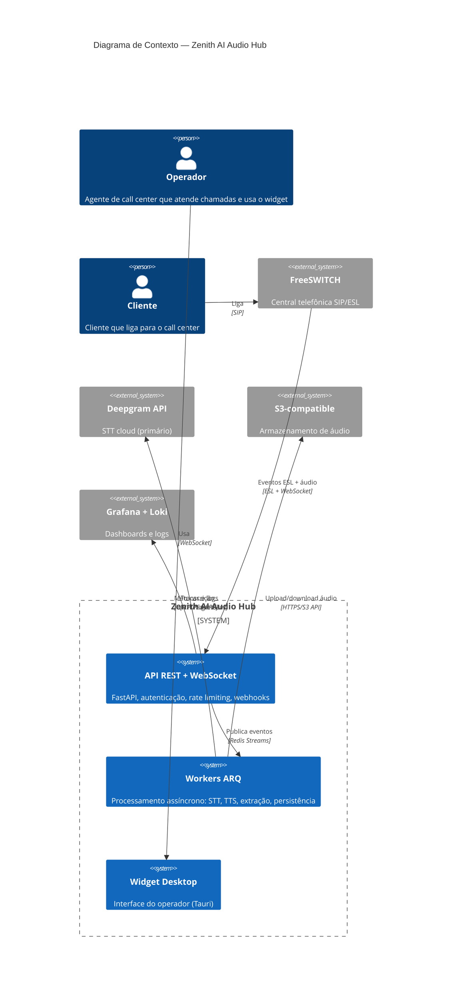

# Arquitetura — zenith-voip

> Gerado pelo Architect — 2026-06-19
> Nível de documentação: completo
> Escala: 🟢 CONFIRMADO | 🟡 INFERIDO | 🔴 LACUNA

## Visão Geral

**Zenith AI Audio Hub** v1.0.0 é um sistema de IA para transcrição e análise de chamadas VoIP em tempo real. Opera com arquitetura de microsserviços orchestrata via Docker Compose, com 14 containers, mensageria assíncrona via Redis Streams, e banco de dados PostgreSQL com multitenancy físico (schema-per-tenant).

## Princípios Arquiteturais

| Princípio | Aplicação |
|-----------|-----------|
| **Isolamento de tenant** | Schema PostgreSQL separado por tenant + scoped sessions |
| **Fallback resiliente** | STT e TTS com fallback automático (cloud → local) |
| **Processamento assíncrono** | Chamadas processadas via Redis Streams + Workers ARQ |
| **LLM local (privacidade)** | Ollama (Mistral 7B) — nenhum dado enviado para nuvem |
| **Alta disponibilidade** | 2 instâncias FastAPI com sticky session via BunkerWeb |

## Diagrama de Contexto (C4 Nível 1)



## Stack Tecnológica

| Camada | Tecnologia | Versão |
|--------|-----------|--------|
| Web framework | FastAPI | 0.115.6 |
| ASGI server | uvicorn | 0.34.0 |
| ORM | SQLAlchemy | 2.0.36 |
| Banco | PostgreSQL | 16-alpine |
| Cache/Fila | Redis | 7-alpine |
| Workers | ARQ | 0.26.1 |
| STT primário | Deepgram SDK | 3.7.0 |
| STT fallback | Whisper.cpp | - |
| TTS | Piper TTS | 1.2.0 |
| LLM local | Ollama (Mistral 7B) | 0.5.7 |
| Orquestração IA | LangGraph | 0.2.60 |
| Desktop | Tauri (Rust) | - |
| Proxy reverso | BunkerWeb | 1.5.12 |
| Observabilidade | OpenTelemetry + Prometheus + Grafana + Loki | - |

## Fluxo Principal de uma Chamada

```
Cliente → FreeSWITCH → ESL Events → FastAPI → Redis Streams → Workers
                                                                    ↓
              Widget ← WebSocket ← FastAPI ← Workers (STT, IA, extração)
                                                                    ↓
                                                          PostgreSQL
```

1. **FreeSWITCH** recebe chamada SIP e gera eventos ESL
2. **ESLClient** escuta e processa: CHANNEL_CREATE → CHANNEL_ANSWER → CHANNEL_HANGUP
3. **AudioIngestor** recebe stream de áudio do FreeSWITCH via WebSocket
4. Chunks de áudio publicados no Redis Stream `call:events`
5. **Workers ARQ** consomem: STT (Deepgram → fallback Whisper), extração de dados, anomalias
6. Transcripts bufferizados no Redis e persistidos em lote no PostgreSQL
7. **ConsensusGraph** (LangGraph) valida entidades em até 3 ciclos
8. Resultados enviados via WebSocket para o Widget Tauri do operador
9. Pós-chamada: webhooks disparados (stubs atualmente)
10. Cleanup diário (03:00): deleta áudio S3 com mais de 90 dias

## Dívidas Técnicas

| ID | Tipo | Descrição | Localização | Severidade |
|----|------|-----------|-------------|------------|
| TD01 | Funcionalidade incompleta | `_detect_channel()` retorna "tx" hardcoded — canal RX nunca identificado | `src/audio/ingestor.py:70-71` | 🔴 Alta |
| TD02 | Stub | `analyze_sentiment()` não implementado | `src/workers/post_call.py:7-12` | 🔴 Alta |
| TD03 | Stub | `audit_procedure()` não implementado | `src/workers/post_call.py:7-12` | 🔴 Alta |
| TD04 | Segurança | JWT_SECRET = "change-me-in-production" | `config.py` | 🔴 Alta |
| TD05 | Segurança | ESL password = "ClueCon" (default FreeSWITCH) | `config.py` | 🔴 Alta |
| TD06 | Credenciais | DEEPGRAM_API_KEY vazia por padrão | `config.py` | 🟡 Média |
| TD07 | Duplicação | `python-jose` e `pyjwt` ambos instalados para JWT | `requirements.txt` | 🟡 Média |
| TD08 | Cobertura de testes | ~30% de cobertura estimada, sem testes unitários | `tests/` | 🟡 Média |
| TD09 | Observabilidade | Logs do ESL Client sem estruturação adequada | `src/telephony/esl_client.py` | 🟡 Média |
| TD10 | Configuração | S3 credentials expostas via env, sem secrets management | `docker-compose.app.yml` | 🔴 Alta |

## Papel do FreeSWITCH: B2BUA com Registration Forwarding

O FreeSWITCH **não** é apenas uma "central telefônica" — é um **B2BUA (Back-to-Back User Agent)** posicionado entre os interfones do cliente e o PBX de produção (VitalPBX / GPhone em `sip.maisalerta.tecnorise.com`).

- Interfones registram no FreeSWITCH (profile `internal`, porta 5060)
- FreeSWITCH registra upstream no VitalPBX *como cada ramal*, com as mesmas credenciais SIP
- VitalPBX e sistemas satélite enxergam os ramais como registrados normalmente
- FreeSWITCH captura o áudio para transcrição/IA via `mod_audio_stream` (substituiu `mod_audio_fork`, descontinuado — feature `007-audio-stream-migration`)
- Provisionamento dinâmico via `mod_xml_curl`: banco Zenith (tabela `SIPExtension`) é a fonte de verdade

Ver ADR-006 e `_reversa_sdd/telephony/design.md` para topologia completa.

## Decisões Arquiteturais (ADRs)

Ver `_reversa_sdd/adrs/`:
- `001-multitenancy-schema-per-tenant.md` — Schema PostgreSQL isolado por tenant
- `002-stt-fallback-automatico.md` — Deepgram → Whisper com timeout 500ms
- `003-dados-sensiveis-llm-local.md` — Dados sensíveis nunca saem do ambiente local
- `004-consenso-3-ciclos.md` — LangGraph com até 3 iterações
- `005-freewitch-esl-reconexao-automatica.md` — Reconexão ESL com backoff 2s
- `006-b2bua-registration-forwarding.md` — FreeSWITCH como B2BUA com Registration Forwarding para VitalPBX
