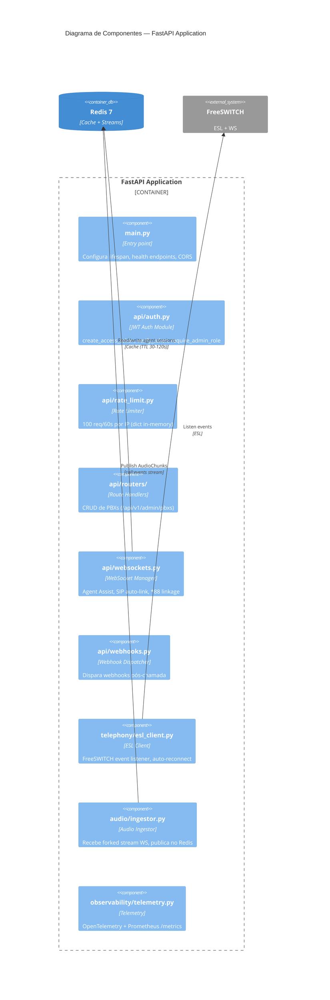
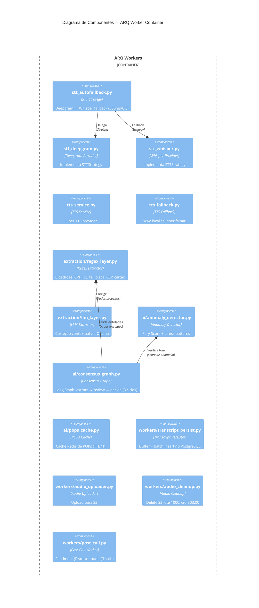

# Diagrama C4 — Componentes (Nível 3)

> Gerado pelo Architect — 2026-06-19
> Escala: 🟢 CONFIRMADO | 🟡 INFERIDO | 🔴 LACUNA

## Propósito

Detalhar os componentes internos dos containers mais relevantes.

## FastAPI Application (Container Principal)



### Componentes da FastAPI

| Componente | Arquivo | Responsabilidade | Confiança |
|-----------|---------|-----------------|-----------|
| **main.py** | `src/main.py` | Entry point FastAPI, lifespan init_db, /health, /ready | 🟢 |
| **Auth Module** | `src/api/auth.py` | Geração JWT, verificação, RBAC (agent/tenant_admin) | 🟢 |
| **Rate Limiter** | `src/api/rate_limit.py` | Rate limit in-memory por IP | 🟢 |
| **PBX Router** | `src/api/routers/pbxs.py` | CRUD de PBXs (admin only) | 🟢 |
| **WebSocket Manager** | `src/api/websockets.py` | Agent assist, SIP auto-link, manual linkage *88, alertas | 🟢 |
| **Webhook Dispatcher** | `src/api/webhooks.py` | Dispara webhooks para URLs configuradas | 🟢 |
| **ESL Client** | `src/telephony/esl_client.py` | Conexão FreeSWITCH ESL, auto-reconnect, SIP mapping | 🟢 |
| **Audio Ingestor** | `src/audio/ingestor.py` | Recebe áudio via WS, detecta canal (🔴 stub), publica evento | 🟢 |
| **Telemetry** | `src/observability/telemetry.py` | OpenTelemetry setup, /metrics Prometheus | 🟢 |

## Worker Application (Container ARQ)



## Fluxo de Componentes por Chamada

```
FreeSWITCH → ESL Client (esl_client.py)
                  ↓
         Audio Ingestor (ingestor.py)
                  ↓
         Redis Stream (call:events)
                  ↓
    ┌──── ARQ Workers ──────────────────────────┐
    │  STT AutoFallback (Deepgram → Whisper)    │
    │  Regex Extraction (CPF, RG, tel, placa…)  │
    │  LLM Correction (Ollama Mistral 7B)       │
    │  Anomaly Detection (Fury Score + Stress)  │
    │  Consensus Graph (3 ciclos LangGraph)     │
    │  Transcript Persist (batch insert)        │
    └────────────────────────────────────────────┘
                  ↓
         WebSocket Manager → Widget Tauri
```
