# Diagrama C4 — Containers (Nível 2)

> Gerado pelo Architect — 2026-06-19
> Escala: 🟢 CONFIRMADO | 🟡 INFERIDO | 🔴 LACUNA

## Propósito

Mostrar os containers (aplicações, bancos, filas) que compõem o sistema e suas interações.

## Diagrama

```mermaid
C4Container
  title Diagrama de Containers — Zenith AI Audio Hub

  Person(agent, "Operador", "Usa o widget desktop")
  Person(customer, "Cliente", "Liga via SIP")

  System_Boundary(zenith, "Zenith AI Audio Hub") {
    Container(api1, "FastAPI Instance 1", "Python FastAPI", "REST API + WebSocket Server + ESL Client + Audio Ingestor")
    Container(api2, "FastAPI Instance 2", "Python FastAPI", "REST API + WebSocket Server + ESL Client + Audio Ingestor")

    ContainerDb(redis, "Redis 7", "Redis + Redis Streams", "Cache, event bus, filas ARQ, session store")

    Container(worker_stt, "Worker STT", "Python ARQ", "Deepgram + Whisper fallback, transcript buffer")
    Container(worker_extraction, "Worker Extraction", "Python ARQ", "Regex extraction + LLM correction")
    Container(worker_ai, "Worker AI", "Python ARQ (LangGraph)", "Anomaly detection + Consensus graph")
    Container(worker_postcall, "Worker Post-Call", "Python ARQ", "Sentiment analysis (stub), audit (stub)")
    Container(worker_upload, "Worker Upload", "Python ARQ", "S3 audio upload")
    Container(worker_cleanup, "Worker Cleanup", "Python ARQ (cron)", "S3 cleanup diário (90 dias)")
    Container(worker_transcript, "Worker Transcript", "Python ARQ", "Batch persist de transcrições")

    ContainerDb(postgres, "PostgreSQL 16", "PostgreSQL", "Schema per-tenant: public + tenant_*")

    Container(widget, "Widget Desktop", "Tauri (Rust + HTML/JS)", "UI sempre-on-top, WebSocket client, system tray")
  }

  System_Ext(fs, "FreeSWITCH", "PBX SIP, ESL events, forked audio WS")
  System_Ext(dg, "Deepgram API", "STT cloud")
  System_Ext(ollama, "Ollama (Mistral 7B)", "LLM local")
  System_Ext(piper, "Piper TTS", "TTS local")
  System_Ext(s3, "S3-compatible", "Storage")
  System_Ext(grafana, "Grafana + Loki", "Dashboards e logs")
  System_Ext(prom, "Prometheus", "Métricas")
  System_Ext(bw, "BunkerWeb", "Proxy reverso")

  Rel(customer, fs, "Liga", "SIP")
  Rel(fs, api1, "ESL events + WS audio", "ESL/WS")
  Rel(fs, api2, "ESL events + WS audio", "ESL/WS")
  Rel(agent, widget, "Usa", "Desktop")
  Rel(widget, bw, "WebSocket", "WSS")
  Rel(bw, api1, "Proxy", "HTTP")
  Rel(bw, api2, "Proxy", "HTTP")

  Rel(api1, redis, "Publish events, cache", "Redis")
  Rel(api2, redis, "Publish events, cache", "Redis")

  Rel(redis, worker_stt, "Consume stream", "ARQ/Redis")
  Rel(redis, worker_extraction, "Consume stream", "ARQ/Redis")
  Rel(redis, worker_ai, "Consume stream", "ARQ/Redis")
  Rel(redis, worker_postcall, "Consume stream", "ARQ/Redis")
  Rel(redis, worker_upload, "Consume stream", "ARQ/Redis")
  Rel(redis, worker_cleanup, "Cron trigger", "ARQ/Redis")
  Rel(redis, worker_transcript, "Consume stream", "ARQ/Redis")

  Rel(worker_stt, dg, "Transcrever", "HTTPS/gRPC")
  Rel(worker_stt, postgres, "Persistir transcript", "asyncpg")
  Rel(worker_extraction, ollama, "Corrigir extração", "HTTP")
  Rel(worker_extraction, postgres, "Persistir entidades", "asyncpg")
  Rel(worker_ai, postgres, "Persistir insights", "asyncpg")
  Rel(worker_postcall, postgres, "Persistir análise", "asyncpg")
  Rel(worker_upload, s3, "Upload áudio", "HTTPS/S3")
  Rel(worker_cleanup, s3, "Delete batch (1000)", "HTTPS/S3")
  Rel(worker_transcript, postgres, "Batch insert", "asyncpg")

  Rel(api1, prom, "/metrics", "HTTP")
  Rel(api2, prom, "/metrics", "HTTP")
```

## Containers

| Container | Tecnologia | Função | Réplicas |
|-----------|-----------|--------|----------|
| **FastAPI Instance 1** | Python FastAPI + uvicorn | API REST, WebSocket server, ESL client, audio ingestion | 1 |
| **FastAPI Instance 2** | Python FastAPI + uvicorn | API REST, WebSocket server (HA) | 1 |
| **Redis 7** | Redis + Redis Streams | Cache, event bus, fila ARQ, sessões | 1 |
| **Worker STT** | Python ARQ | Deepgram → Whisper fallback | 1 |
| **Worker Extraction** | Python ARQ | Regex + LLM contextual correction | 1 |
| **Worker AI** | Python ARQ + LangGraph | Anomalias + consenso | 1 |
| **Worker Post-Call** | Python ARQ | Sentimento + auditoria (stubs) | 1 |
| **Worker Upload** | Python ARQ | S3 upload | 1 |
| **Worker Cleanup** | Python ARQ (cron) | S3 cleanup diário 03:00 | 1 |
| **Worker Transcript** | Python ARQ | Batch persist de transcrições | 1 |
| **PostgreSQL 16** | PostgreSQL com asyncpg | Banco principal, schema-per-tenant | 1 |
| **Widget Desktop** | Tauri (Rust) + HTML/JS | UI operador, sempre-on-top | N (por operador) |

## Stack de Containers Docker

| Serviço Docker | Imagem | Depende de |
|---------------|--------|-----------|
| `zenith-api-1` | Dockerfile (Python) | Redis, PostgreSQL, FreeSWITCH |
| `zenith-api-2` | Dockerfile (Python) | Redis, PostgreSQL, FreeSWITCH |
| `zenith-worker` | Dockerfile (Python) | Redis, PostgreSQL, Deepgram, Ollama, Piper, S3 |
| `bunkerweb` | bunkerity/bunkerweb:1.5.12 | zenith-api-1, zenith-api-2 |
| `postgres` | postgres:16-alpine | - |
| `redis` | redis:7-alpine | - |
| `ollama` | ollama/ollama:0.5.7 | GPU reservada |
| `piper-tts` | rhasspy/piper-tts:2023.11.14 | - |
| `freeswitch` | safarov/freeswitch:1.10.12 | network_mode: host |
| `prometheus` | prom/prometheus:v2.55.1 | zenith-api |
| `grafana` | grafana/grafana:11.3.0 | Prometheus, Loki |
| `loki` | grafana/loki:3.2.1 | - |
