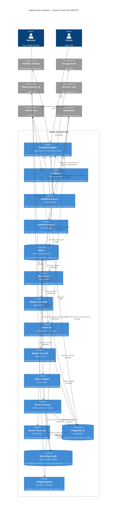

# Diagrama C4 — Containers (Nível 2)

> Gerado pelo Architect — 2026-06-19
> **Re-extração incremental — 2026-07-27** (deltas D-09/D-11/D-12/D-13)
> Escala: 🟢 CONFIRMADO | 🟡 INFERIDO | 🔴 LACUNA

## Propósito

Mostrar os containers (aplicações, bancos, filas) que compõem o sistema e suas interações.

## O que mudou nesta revisão

| Mudança | Efeito no diagrama |
|---|---|
| S3 removido | `System_Ext(s3)` eliminado; upload e cleanup passam a falar com o tmpfs local |
| Piper TTS in-process | `System_Ext(piper)` eliminado; TTS vira responsabilidade da própria FastAPI |
| Sidecar `ip-watcher` | Container novo, com relação própria para o FreeSWITCH |
| FreeSWITCH com build próprio | Deixa de ser puramente externo — a imagem é do projeto |
| Só a instância 1 consome ESL | Relação `fs → api2` (ESL) removida |

## Diagrama

```mermaid
C4Container
  title Diagrama de Containers — Zenith AI Audio Hub (2026-07)

  Person(agent, "Operador", "Usa o widget desktop")
  Person(customer, "Cliente", "Liga via SIP")

  System_Boundary(zenith, "Zenith AI Audio Hub") {
    Container(fs, "FreeSWITCH B2BUA", "Build próprio + mod_audio_stream", "Termina SIP dos dois lados, é a ponte de mídia, expõe ESL")
    Container(watcher, "IP Watcher", "Python (sidecar)", "Descobre IP público, reescreve vars-external-ip.xml, recarrega profile upstream")

    Container(api1, "FastAPI Instance 1", "Python FastAPI", "REST + WS + ESL Client + Audio Ingestor + Piper TTS in-process")
    Container(api2, "FastAPI Instance 2", "Python FastAPI", "REST + WS + Piper TTS in-process (NÃO consome ESL)")

    ContainerDb(redis, "Redis 7", "Redis + Redis Streams", "Cache, event bus, filas ARQ, session store")

    Container(worker_stt, "Worker STT", "Python ARQ", "Deepgram + Whisper fallback, transcript buffer")
    Container(worker_extraction, "Worker Extraction", "Python ARQ", "Regex extraction + LLM correction")
    Container(worker_ai, "Worker AI", "Python ARQ (LangGraph)", "Anomaly detection + Consensus graph (MemorySaver)")
    Container(worker_postcall, "Worker Post-Call", "Python ARQ", "Sentiment analysis (stub), audit (stub)")
    Container(worker_upload, "Worker Upload", "Python ARQ", "Grava .raw e converte para MP3 via ffmpeg")
    Container(worker_cleanup, "Worker Cleanup", "Python ARQ (cron 15min)", "Remove gravações com mtime acima do TTL")
    Container(worker_transcript, "Worker Transcript", "Python ARQ", "Batch persist de transcrições")

    ContainerDb(postgres, "PostgreSQL 16", "PostgreSQL", "Schema per-tenant: public + tenant_*")
    ContainerDb(tmpfs, "Recordings tmpfs", "tmpfs 512MB em RAM", "RECORDINGS_PATH/tenant/call_id/channel.mp3 — TTL ~1h")

    Container(widget, "Widget Desktop", "Tauri (Rust + HTML/JS)", "UI sempre-on-top, WebSocket client, system tray")
  }

  System_Ext(pbx, "VitalPBX / GPhone", "PBX de produção do cliente")
  System_Ext(dg, "Deepgram API", "STT cloud")
  System_Ext(ollama, "Ollama (Mistral 7B)", "LLM local")
  System_Ext(grafana, "Grafana + Loki", "Dashboards e logs")
  System_Ext(prom, "Prometheus", "Métricas")
  System_Ext(bw, "BunkerWeb", "Proxy reverso, sticky session")

  Rel(customer, fs, "Liga", "SIP")
  Rel(fs, pbx, "Registra ramais e faz bridge upstream", "SIP")
  Rel(watcher, fs, "reloadxml + sofia profile upstream restart", "ESL")
  Rel(watcher, fs, "Escreve vars-external-ip.xml", "volume compartilhado")

  Rel(fs, api1, "Event stream ESL", "ESL")
  Rel(api1, fs, "api/bgapi (uuid_audio_stream) — socket dedicado", "ESL")
  Rel(fs, api1, "Áudio PCM16 estéreo 8k", "WS /audio-stream/{call_id}")

  Rel(agent, widget, "Usa", "Desktop")
  Rel(widget, bw, "WebSocket", "WSS")
  Rel(bw, api1, "Proxy", "HTTP")
  Rel(bw, api2, "Proxy", "HTTP")

  Rel(api1, redis, "Publish events, cache, enqueue", "Redis")
  Rel(api2, redis, "Publish events, cache", "Redis")

  Rel(redis, worker_stt, "Consume stream", "ARQ/Redis")
  Rel(redis, worker_extraction, "Consume stream", "ARQ/Redis")
  Rel(redis, worker_ai, "Consume stream", "ARQ/Redis")
  Rel(redis, worker_postcall, "Consume stream", "ARQ/Redis")
  Rel(redis, worker_upload, "Consume job upload_recording_batch", "ARQ/Redis")
  Rel(redis, worker_cleanup, "Cron trigger 15min", "ARQ/Redis")
  Rel(redis, worker_transcript, "Consume stream", "ARQ/Redis")

  Rel(worker_stt, dg, "Transcrever", "HTTPS/gRPC")
  Rel(worker_stt, postgres, "Persistir transcript", "asyncpg")
  Rel(worker_extraction, ollama, "Corrigir extração", "HTTP")
  Rel(worker_ai, postgres, "Persistir insights", "asyncpg")
  Rel(worker_upload, tmpfs, "Grava .raw, converte MP3, remove .raw", "filesystem")
  Rel(worker_cleanup, tmpfs, "os.walk + remove por mtime", "filesystem")
  Rel(worker_cleanup, postgres, "SELECT tenants ativos", "asyncpg")
  Rel(worker_transcript, postgres, "Batch insert", "asyncpg")
  Rel(api1, postgres, "create/finalize Call (schema do tenant)", "asyncpg")

  Rel(api1, prom, "/metrics", "HTTP")
  Rel(api2, prom, "/metrics", "HTTP")
```

## Containers

| Container | Tecnologia | Função | Réplicas |
|-----------|-----------|--------|----------|
| **FreeSWITCH B2BUA** 🔄 | Build próprio (`freeswitch/Dockerfile`) + `mod_audio_stream` | Ponte de mídia, registration forwarding, ESL | 1 (`network_mode: host`) |
| **IP Watcher** 🆕 | Python + `requests` (sidecar) | Mantém `external_sip_ip`/`external_rtp_ip` corretos | 1 (`network_mode: host`) |
| **FastAPI Instance 1** | Python FastAPI + uvicorn | API REST, WS, **ESL client**, audio ingestion, TTS | 1 |
| **FastAPI Instance 2** 🔄 | Python FastAPI + uvicorn | API REST, WS, TTS — **não consome ESL** | 1 |
| **Redis 7** | Redis + Redis Streams | Cache, event bus, fila ARQ, sessões | 1 |
| **Worker STT** | Python ARQ | Deepgram → Whisper fallback | 1 |
| **Worker Extraction** | Python ARQ | Regex + LLM contextual correction | 1 |
| **Worker AI** | Python ARQ + LangGraph | Anomalias + consenso (estado in-process) | 1 |
| **Worker Post-Call** | Python ARQ | Sentimento + auditoria (🔴 stubs) | 1 |
| **Worker Upload** 🔄 | Python ARQ + ffmpeg | Grava `.raw` → converte MP3 por canal | 1 (`zenith-arq-uploader`) |
| **Worker Cleanup** 🔄 | Python ARQ (cron 15 min) | Remove gravações por `mtime` | 1 (`zenith-arq-cleanup`) |
| **Worker Transcript** | Python ARQ | Batch persist de transcrições | 1 |
| **PostgreSQL 16** | PostgreSQL com asyncpg | Banco principal, schema-per-tenant | 1 |
| **Recordings tmpfs** 🆕 | tmpfs 512 MB (RAM) | Gravações MP3 com TTL de ~1 h | volume compartilhado |
| **Widget Desktop** | Tauri (Rust) + HTML/JS | UI operador, sempre-on-top | N (por operador) |

## Stack de Containers Docker

| Serviço Docker | Imagem | Depende de |
|---------------|--------|-----------|
| `zenith-freeswitch` 🔄 | **build local** `./freeswitch` (secret `signalwire_token`) | `network_mode: host` |
| `zenith-ip-watcher` 🆕 | **build local** `./sidecar` | zenith-freeswitch |
| `zenith-api-1` | Dockerfile (Python) | Redis, PostgreSQL, FreeSWITCH |
| `zenith-api-2` | Dockerfile (Python) | Redis, PostgreSQL |
| `zenith-arq-uploader` 🆕 | Dockerfile (Python) | Redis, PostgreSQL, tmpfs |
| `zenith-arq-cleanup` | Dockerfile (Python) | Redis, PostgreSQL, tmpfs |
| `zenith-bunkerweb` | bunkerity/bunkerweb:1.5.12 | zenith-api-1, zenith-api-2 |
| `postgres` | postgres:16-alpine | - |
| `redis` | redis:7-alpine | - |
| `zenith-ollama` | ollama/ollama:0.5.7 | GPU reservada |
| ~~`piper-tts`~~ | ~~rhasspy/piper-tts~~ | ❌ **removido** — TTS roda in-process |
| `prometheus` | prom/prometheus:v2.55.1 | zenith-api |
| `grafana` | grafana/grafana:11.3.0 | Prometheus, Loki |
| `loki` | grafana/loki:3.2.1 | - |

## Pontos de atenção arquiteturais

| Ponto | Detalhe |
|---|---|
| 🔴 HA parcial | `fastapi-2` é redundância só para HTTP. Se `fastapi-1` cair, **nenhuma chamada é gravada** — o consumo de ESL não faz failover |
| 🔴 Persistência volátil | Gravações vivem em RAM com TTL de 1 h; restart do container zera tudo (ADR-009) |
| 🔴 tmpfs sem backpressure | 512 MB é teto rígido; enchendo, a escrita falha por chamada sem alarme agregado |
| 🟡 Dois dialetos de ESL | O sidecar fala ESL em socket bruto síncrono; a API usa `ESLClient` assíncrono. Nenhum reusa o outro |
| 🟡 Métricas órfãs | O módulo `observability` ainda expõe métricas de S3, subsistema que não existe mais |
