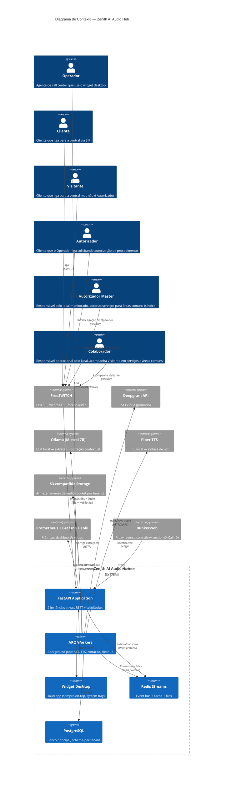

# Diagrama C4 — Contexto (Nível 1)

> Gerado pelo Architect — 2026-06-19
> Escala: 🟢 CONFIRMADO | 🟡 INFERIDO | 🔴 LACUNA

## Propósito

Mostrar o sistema Zenith AI Audio Hub no centro, com seus usuários e sistemas externos.

## Diagrama

## Atores

| Ator | Descrição | Tipo |
|------|-----------|------|
| **Operador** | Agente de call center que usa o widget desktop para acompanhamento de chamadas | Person |
| **Cliente** | Pessoa que liga para a central via SIP | Person |
| **Visitante** | Cliente que liga para a central mas não é Autorizador | Person |
| **Autorizador** | Cliente que o Operador liga solicitando autorização de procedimento | Person |
| **Autorizador Master** | Responsável pelo local monitorado, autoriza serviços para áreas comuns (síndico) | Person |
| **Colaborador** | Responsável operacional pelo local, acompanha Visitante em serviços e áreas comuns | Person |

## Sistemas Externos

| Sistema | Descrição | Protocolo | Confiança |
|---------|-----------|-----------|-----------|
| **FreeSWITCH** | Central telefônica, gera eventos ESL e envia áudio | ESL + WebSocket | 🟢 |
| **Deepgram API** | STT cloud com modelo nova-2 em português | HTTPS/gRPC | 🟢 |
| **Ollama (Mistral 7B)** | LLM local para correção contextual de dados extraídos | HTTP | 🟢 |
| **Piper TTS** | Síntese de voz local | HTTP | 🟢 |
| **S3-compatible** | Storage para arquivos de áudio | HTTPS/S3 API | 🟢 |
| **Prometheus + Grafana + Loki** | Stack de observabilidade | OTLP/HTTP | 🟢 |
| **BunkerWeb** | Proxy reverso com stickiness por X-Call-ID | HTTP | 🟢 |
