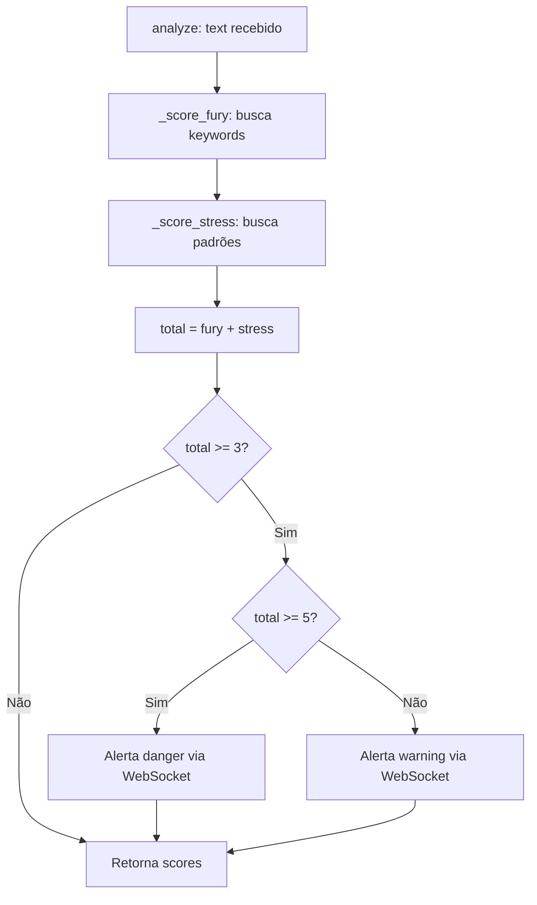
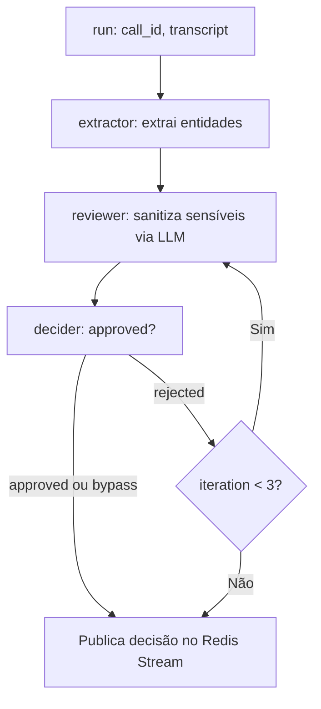

# Fluxograma — Módulo AI

## Detecção de Anomalias

```mermaid
flowchart TD
    A[analyze: text recebido] --> B[_score_fury: busca keywords]
    B --> C[_score_stress: busca padrões]
    C --> D[total = fury + stress]
    D --> E{total >= 3?}
    E -->|Sim| F{total >= 5?}
    F -->|Sim| G[Alerta danger via WebSocket]
    F -->|Não| H[Alerta warning via WebSocket]
    E -->|Não| I[Retorna scores]
    G --> I
    H --> I
```

## Grafo de Consenso (LangGraph)

```mermaid
flowchart TD
    A[run: call_id, transcript] --> B[extractor: extrai entidades]
    B --> C[reviewer: sanitiza sensíveis via LLM]
    C --> D[decider: approved?]
    D -->|approved ou bypass| E[Publica decisão no Redis Stream]
    D -->|rejected| F{iteration < 3?}
    F -->|Sim| C
    F -->|Não| E
```
