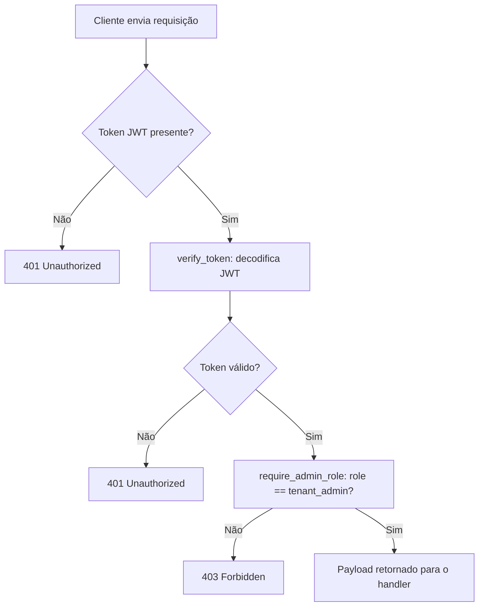
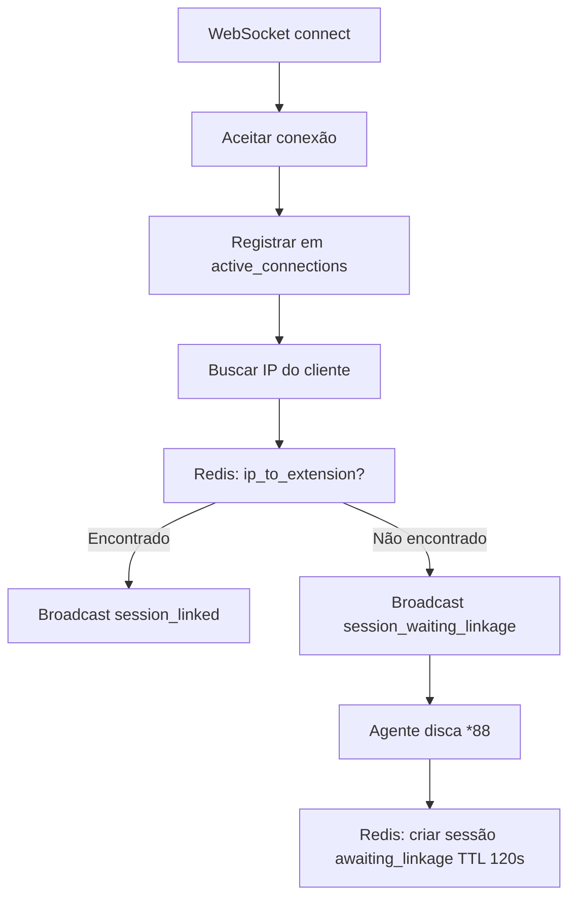
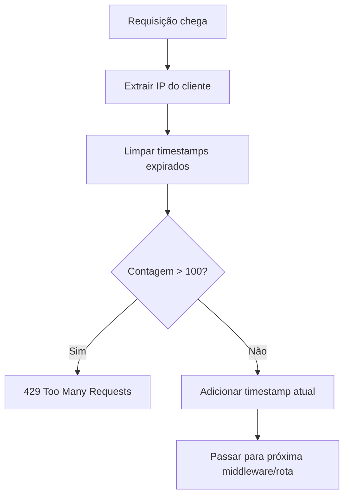

# Fluxograma — Módulo API

## Fluxo de Autenticação (auth.py)

```mermaid
flowchart TD
    A[Cliente envia requisição] --> B{Token JWT presente?}
    B -->|Não| C[401 Unauthorized]
    B -->|Sim| D[verify_token: decodifica JWT]
    D --> E{Token válido?}
    E -->|Não| F[401 Unauthorized]
    E -->|Sim| G[require_admin_role: role == tenant_admin?]
    G -->|Não| H[403 Forbidden]
    G -->|Sim| I[Payload retornado para o handler]
```

## Fluxo de Auto-Link (websockets.py)

```mermaid
flowchart TD
    A[WebSocket connect] --> B[Aceitar conexão]
    B --> C[Registrar em active_connections]
    C --> D[Buscar IP do cliente]
    D --> E[Redis: ip_to_extension?]
    E -->|Encontrado| F[Broadcast session_linked]
    E -->|Não encontrado| G[Broadcast session_waiting_linkage]
    G --> H[Agente disca *88]
    H --> I[Redis: criar sessão awaiting_linkage TTL 120s]
```

## Fluxo de Rate Limit (rate_limit.py)

```mermaid
flowchart TD
    A[Requisição chega] --> B[Extrair IP do cliente]
    B --> C[Limpar timestamps expirados]
    C --> D{Contagem > 100?}
    D -->|Sim| E[429 Too Many Requests]
    D -->|Não| F[Adicionar timestamp atual]
    F --> G[Passar para próxima middleware/rota]
```
