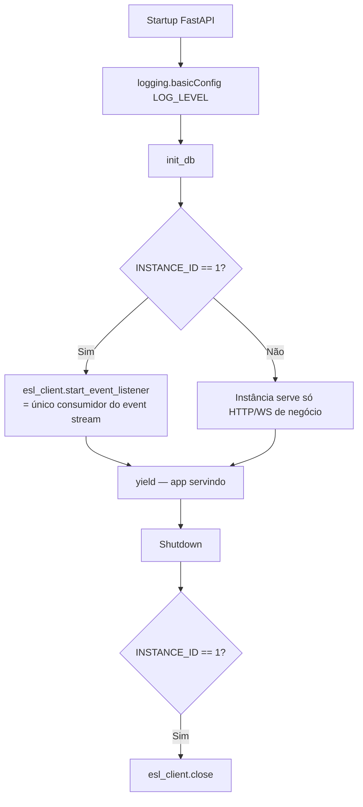
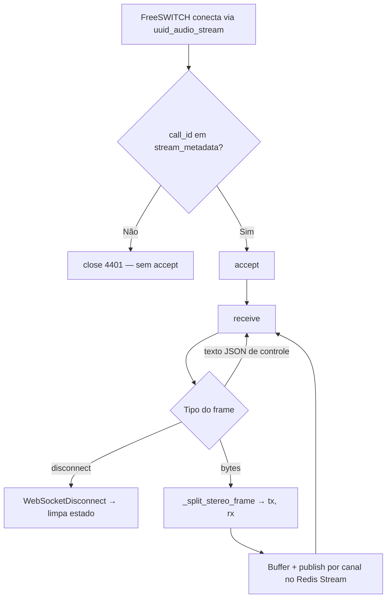
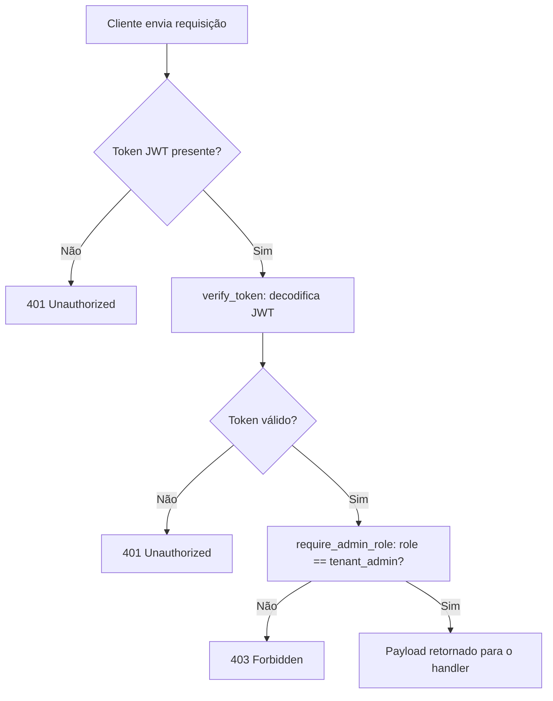
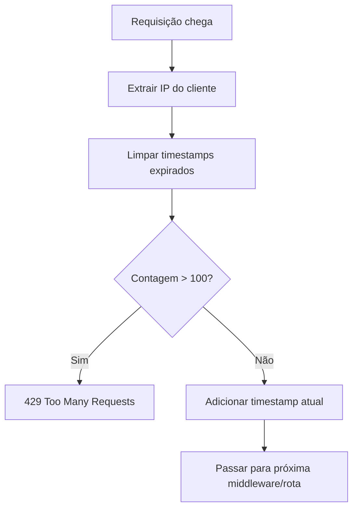

# Fluxograma — Módulo API

> Atualizado na re-extração incremental de **2026-07-27** (delta D-07)

## Ciclo de vida da aplicação (main.py) 🆕

> Antes desta mudança o `esl_client` **nunca era conectado**: os handlers de evento existiam
> mas jamais executavam. O acoplamento a `INSTANCE_ID == 1` existe porque
> `create_call_record()` não é idempotente — e torna `fastapi-1` ponto único de falha para
> a captura de áudio (🟡 risco arquitetural aberto).

## WebSocket de áudio (`/audio-stream/{call_id}`) 🆕

## Fluxo de Autenticação (auth.py)

## Fluxo de Auto-Link (websockets.py)

```mermaid
flowchart TD
    A[WebSocket connect] --> B[Aceitar conexão]
    B --> C[Registrar em active_connections]
    C --> D[Buscar IP do cliente]
    D --> E[Redis: ip_to_extension?]
    E -->|Encontrado| F[Broadcast session_linked]
    E -->|Não encontrado| G[Broadcast session_waiting_linkage]
    G --> H[Agente disca *88]
    H --> I[Redis: criar sessão awaiting_linkage TTL 120s]
```

## Fluxo de Rate Limit (rate_limit.py)

