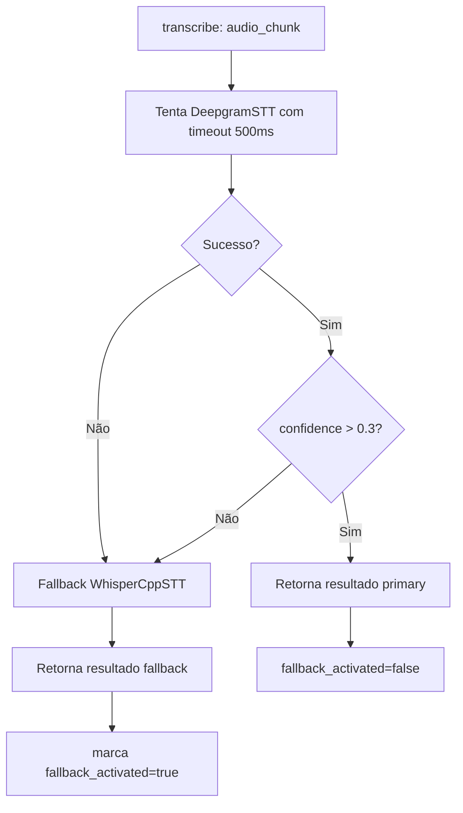
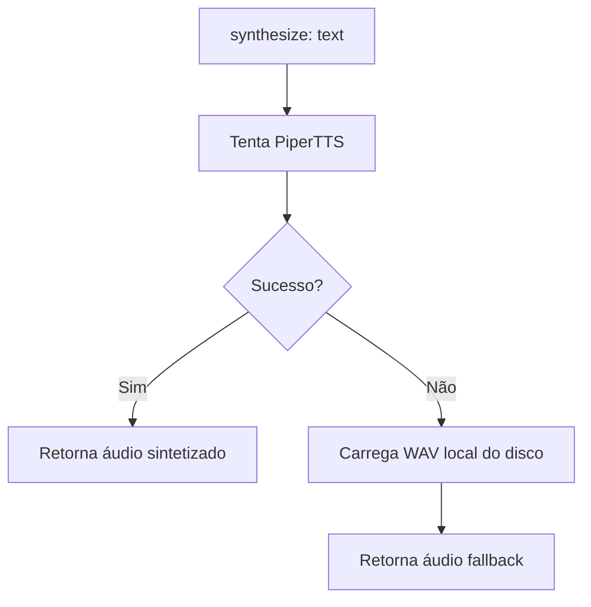

# Fluxograma — Módulo Services

## AutoFallback STT

```mermaid
flowchart TD
    A[transcribe: audio_chunk] --> B[Tenta DeepgramSTT com timeout 500ms]
    B --> C{Sucesso?}
    C -->|Sim| D{confidence > 0.3?}
    D -->|Sim| E[Retorna resultado primary]
    C -->|Não| F[Fallback WhisperCppSTT]
    D -->|Não| F
    F --> G[Retorna resultado fallback]
    G --> H[marca fallback_activated=true]
    E --> I[fallback_activated=false]
```

## TTS com Fallback

```mermaid
flowchart TD
    A[synthesize: text] --> B[Tenta PiperTTS]
    B --> C{Sucesso?}
    C -->|Sim| D[Retorna áudio sintetizado]
    C -->|Não| E[Carrega WAV local do disco]
    E --> F[Retorna áudio fallback]
```
