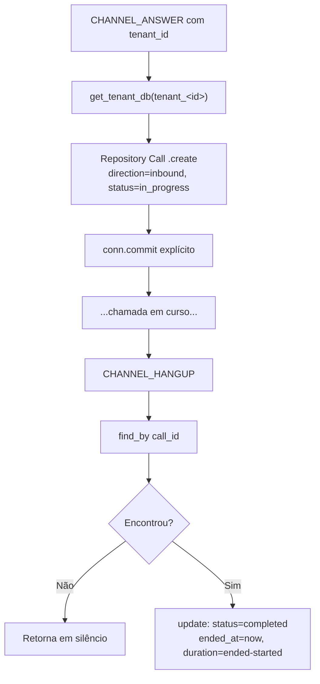
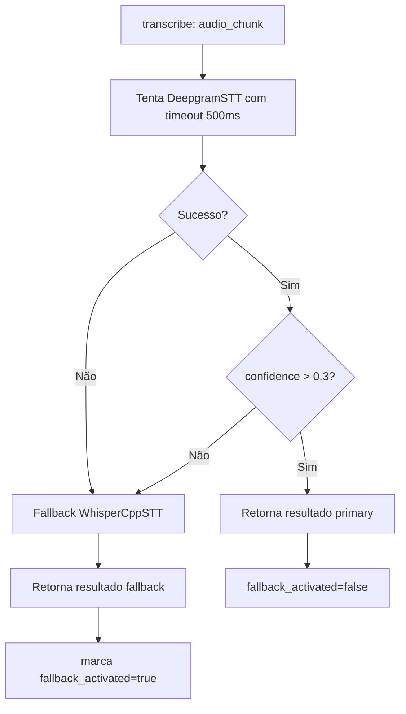
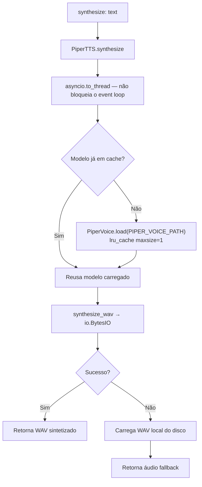

# Fluxograma — Módulo Services

> Atualizado na re-extração incremental de **2026-07-27** (deltas D-05/D-09)

## Ciclo de vida da entidade Call (calls.py) 🆕

## AutoFallback STT

## TTS com Fallback 🔄

> O TTS deixou de ser uma chamada HTTP a um microserviço (`http://piper-tts:5000/synthesize`)
> e passou a rodar **no próprio processo FastAPI**. O container `piper-tts` foi removido.
> Os parâmetros `voice` e `speaker_id` continuam na assinatura mas são ignorados — a voz
> vem de `PIPER_VOICE_PATH`.
