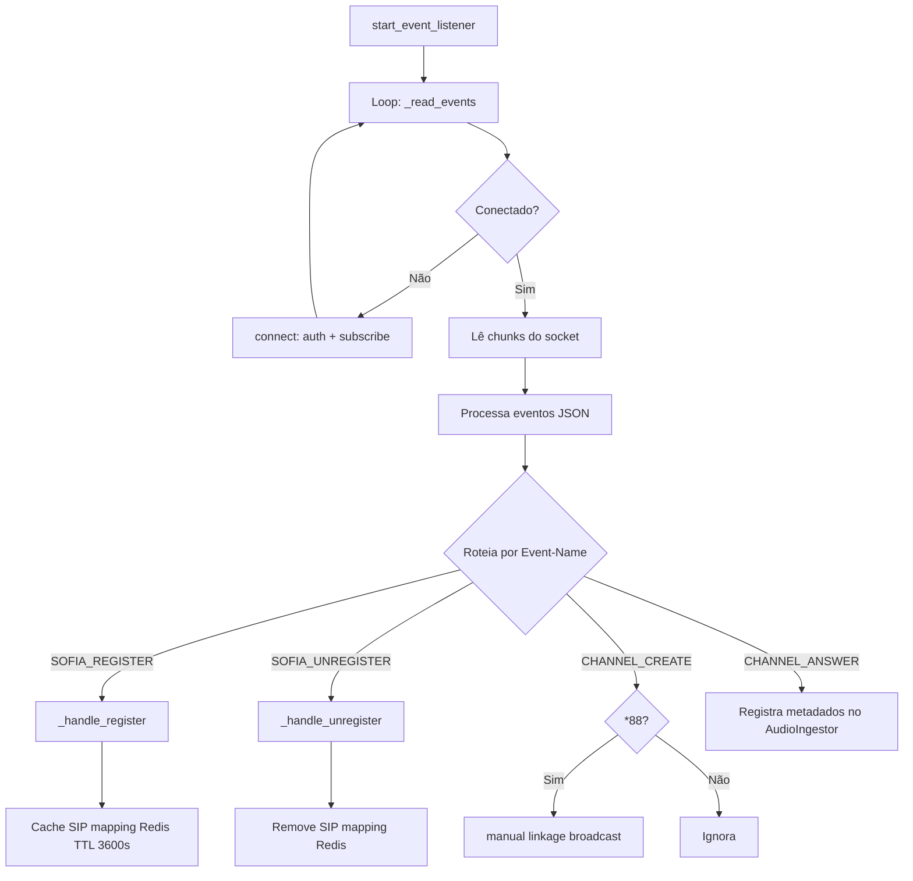
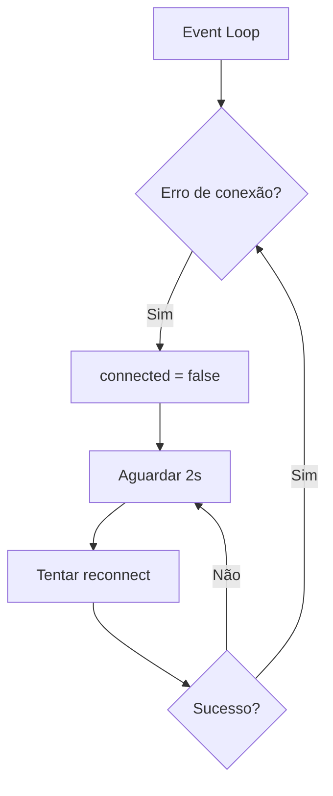

# Fluxograma — Módulo Telephony

## Event Loop ESL

```mermaid
flowchart TD
    A[start_event_listener] --> B[Loop: _read_events]
    B --> C{Conectado?}
    C -->|Não| D[connect: auth + subscribe]
    D --> B
    C -->|Sim| E[Lê chunks do socket]
    E --> F[Processa eventos JSON]
    F --> G{Roteia por Event-Name}
    G -->|SOFIA_REGISTER| H[_handle_register]
    G -->|SOFIA_UNREGISTER| I[_handle_unregister]
    G -->|CHANNEL_CREATE| J{*88?}
    J -->|Sim| K[manual linkage broadcast]
    J -->|Não| L[Ignora]
    G -->|CHANNEL_ANSWER| M[Registra metadados no AudioIngestor]
    H --> N[Cache SIP mapping Redis TTL 3600s]
    I --> O[Remove SIP mapping Redis]
```

## Reconexão Automática

```mermaid
flowchart TD
    A[Event Loop] --> B{Erro de conexão?}
    B -->|Sim| C[connected = false]
    C --> D[Aguardar 2s]
    D --> E[Tentar reconnect]
    E --> F{Sucesso?}
    F -->|Sim| B
    F -->|Não| D
```
