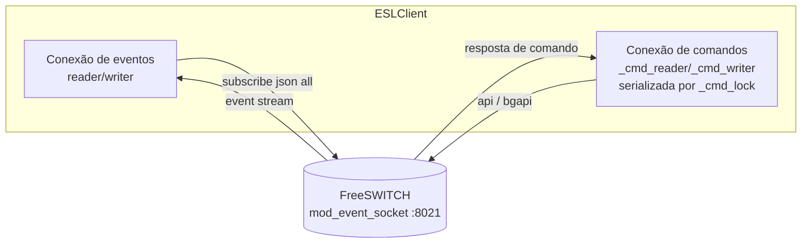
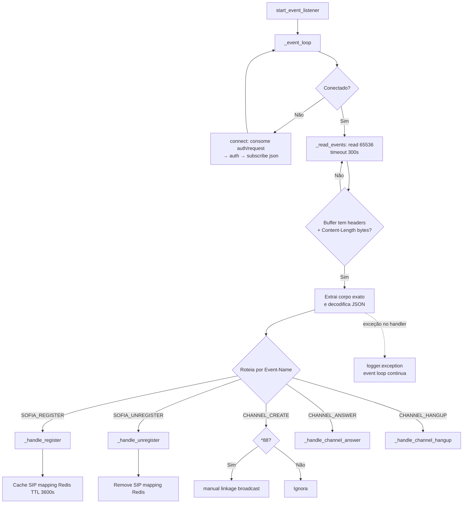
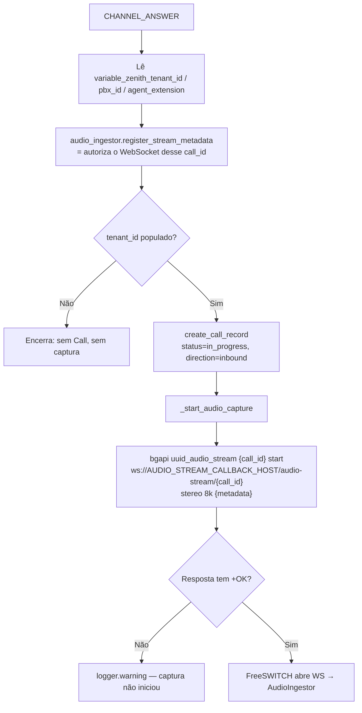
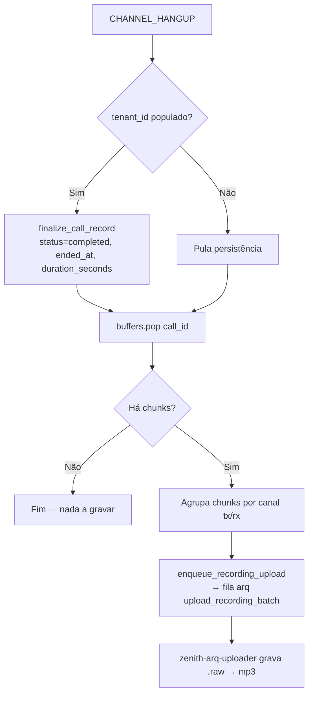
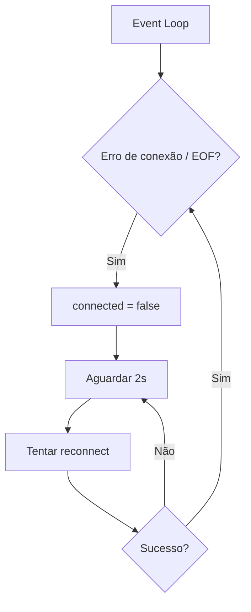
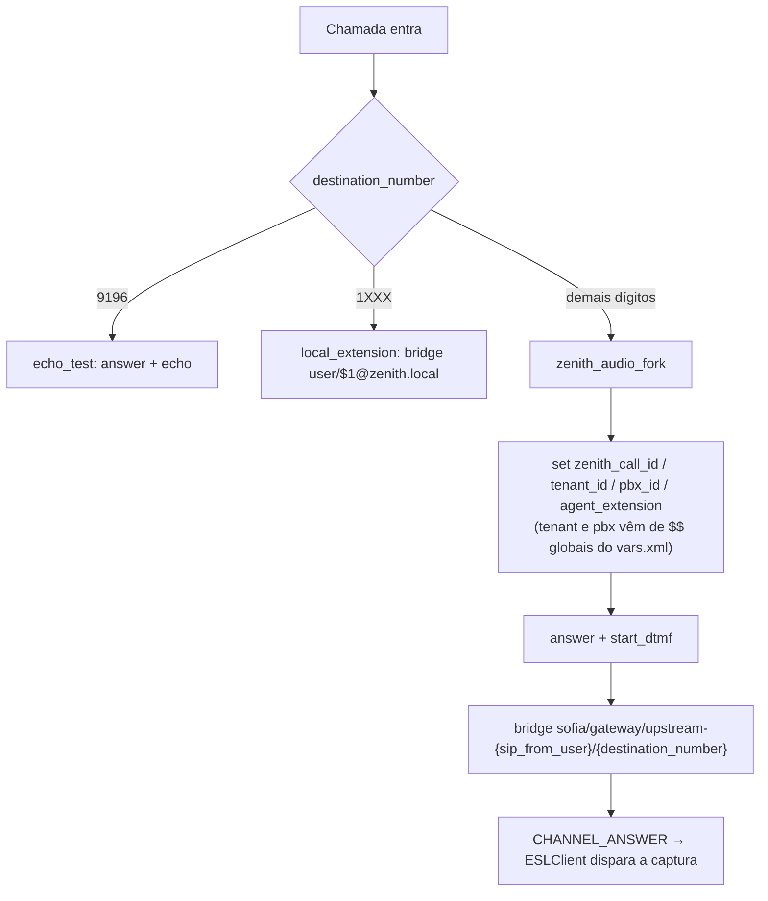

# Fluxograma — Módulo Telephony

> Atualizado na re-extração incremental de **2026-07-27** (deltas D-01/D-12)

## Arquitetura de conexões ESL 🆕

> Antes as duas funções dividiam o mesmo socket: um `bgapi` disparado de dentro de um
> handler de evento competia pela leitura com o event loop, e a resposta podia se misturar
> ao evento seguinte e se perder.

## Event Loop ESL

## CHANNEL_ANSWER — início da gravação 🆕

## CHANNEL_HANGUP — fechamento e gravação 🆕

## Reconexão Automática

> O timeout de leitura subiu de 30 s para **300 s**: o FreeSWITCH não manda heartbeat em
> conexão ociosa, e o timeout curto derrubava a conexão a cada janela sem chamada, criando
> um gap onde um `CHANNEL_ANSWER` real podia chegar e se perder.

## Caminho da chamada no dialplan 🔄

> A captura de áudio **não é mais uma ação do dialplan**. `mod_audio_fork` saiu; o
> `uuid_audio_stream` é disparado pela aplicação, via ESL, depois do `CHANNEL_ANSWER`.
