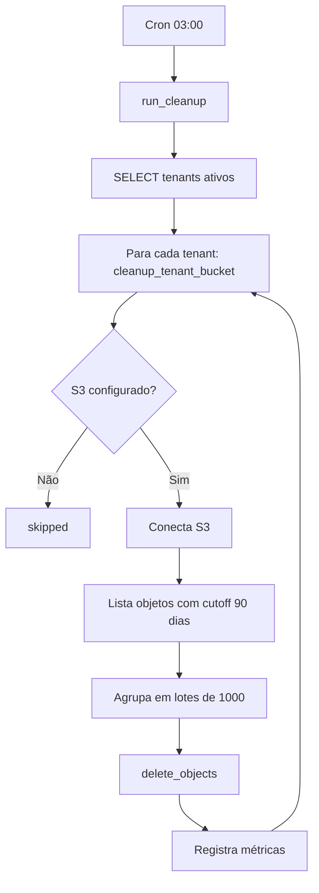
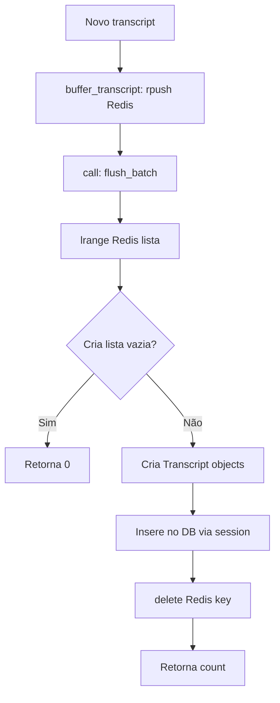

# Fluxograma — Módulo Workers

## Audio Cleanup (Cron Diário)

```mermaid
flowchart TD
    A[Cron 03:00] --> B[run_cleanup]
    B --> C[SELECT tenants ativos]
    C --> D[Para cada tenant: cleanup_tenant_bucket]
    D --> E{S3 configurado?}
    E -->|Não| F[skipped]
    E -->|Sim| G[Conecta S3]
    G --> H[Lista objetos com cutoff 90 dias]
    H --> I[Agrupa em lotes de 1000]
    I --> J[delete_objects]
    J --> K[Registra métricas]
    K --> D
```

## Transcript Persist

```mermaid
flowchart TD
    A[Novo transcript] --> B[buffer_transcript: rpush Redis]
    B --> C[call: flush_batch]
    C --> D[lrange Redis lista]
    D --> E{Cria lista vazia?}
    E -->|Sim| F[Retorna 0]
    E -->|Não| G[Cria Transcript objects]
    G --> H[Insere no DB via session]
    H --> I[delete Redis key]
    I --> J[Retorna count]
```
