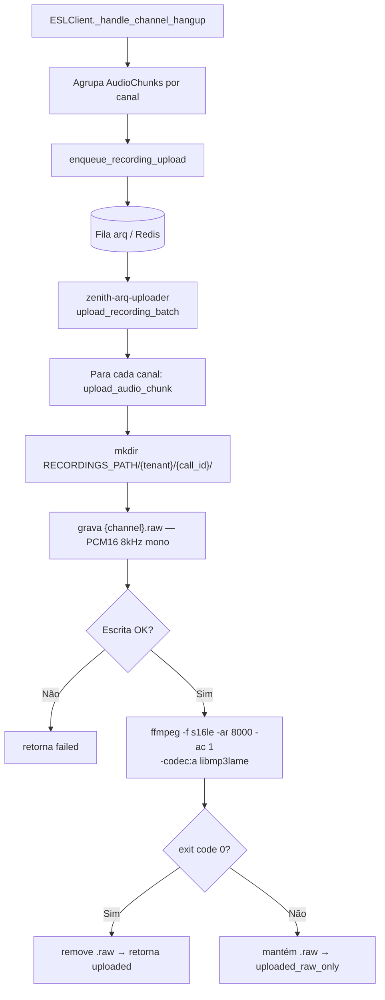
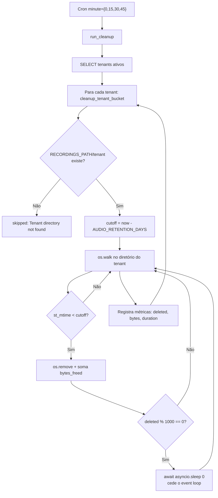
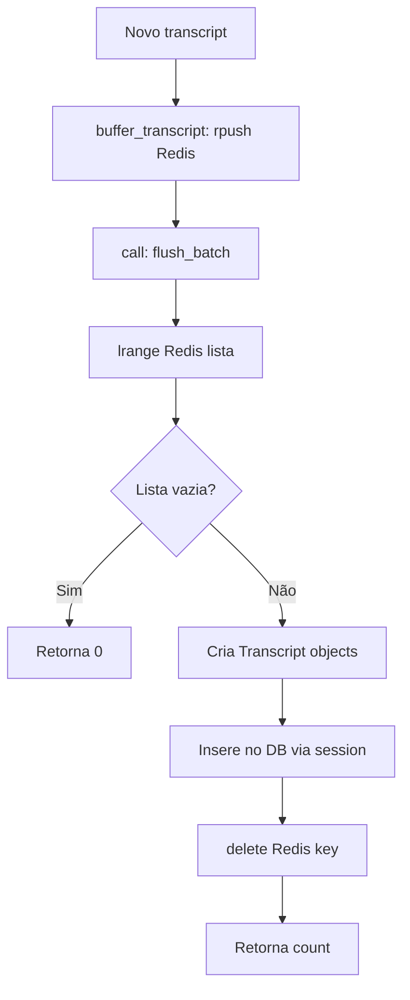
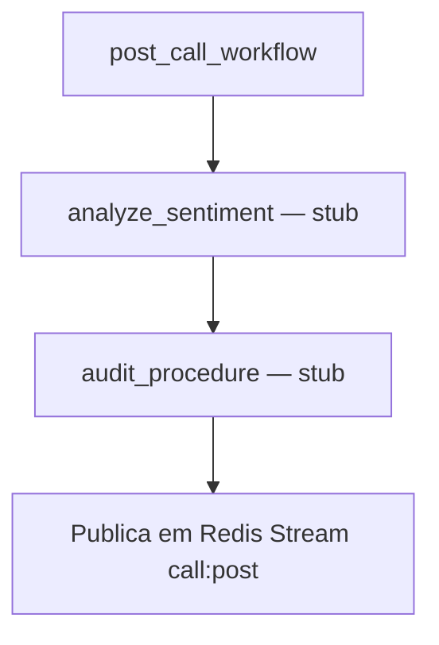

# Fluxograma — Módulo Workers

> Atualizado na re-extração incremental de **2026-07-27** (deltas D-03/D-04).
> **S3 foi removido do projeto** — os fluxos anteriores baseados em `boto3` não valem mais.

## Gravação de chamada (produtor → consumidor) 🆕

> O destino é o volume **tmpfs** `zenith_recordings_tmpfs` (512 MB, em RAM) montado em
> `/data/recordings`. Sai um MP3 mono por canal: `tx.mp3` (agente) e `rx.mp3` (cliente).

## Audio Cleanup (cron a cada 15 min) 🔄

> Retenção em produção: `AUDIO_RETENTION_DAYS=0.0417` (~1 hora). A frequência de 15 min
> existe porque um cron diário deixaria arquivos vivos por até 24 h antes da primeira
> avaliação — o TTL não seria respeitado de verdade.

## Transcript Persist

## Post-call (🔴 ainda stub)

