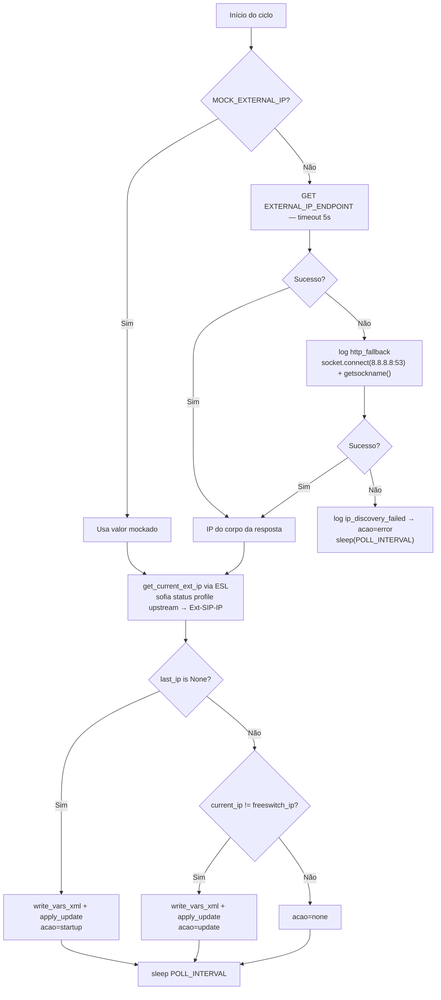

---
spec:
  component: ip-watcher
  layer: sidecar
  status: active
  version: 1.0.0
  language: python
  updated_at: 2026-07-27
---

# Sidecar — IP Watcher · Design

> Gerado pelo Writer — **2026-07-27** (componente novo)

## Decisão estrutural: processo separado

O watcher **não** vive dentro da FastAPI. Três razões o mantêm fora:

1. Precisa de `network_mode: host` para o fallback por rota de saída; a API roda na bridge
   `ai-hub-net`.
2. Precisa escrever no volume de configuração do FreeSWITCH — acesso que a API não tem nem
   deveria ter.
3. Precisa continuar funcionando quando a API estiver caindo ou em rebuild: o registro
   upstream não pode depender do ciclo de vida da aplicação.

O preço é a duplicação do dialeto ESL (ver abaixo).

## Fluxo por ciclo



## Por que comparar contra o FreeSWITCH e não contra `last_ip`

`last_ip` é o que **este processo** aplicou por último. O FreeSWITCH pode ter sido
reiniciado, recarregado por outro caminho, ou ter falhado ao aplicar. Comparar contra o
`Ext-SIP-IP` real fecha essa janela: se o FreeSWITCH perdeu a configuração, o watcher
reaplica no ciclo seguinte mesmo com o IP público inalterado.

O ciclo de boot (`last_ip is None`) aplica incondicionalmente pela mesma razão — não se
assume nada sobre o estado em que o FreeSWITCH subiu.

## Escrita atômica

```python
tmp = path + ".tmp"
with open(tmp, "w") as f:
    f.write(content)
os.replace(tmp, path)
```

`os.replace` é atômico dentro do mesmo filesystem. Sem isso, o `reloadxml` poderia pegar o
arquivo no meio da escrita e falhar o parse do XML — deixando o profile `upstream` sem IP
externo válido.

## Conteúdo gerado

```xml
<include>
  <X-PRE-PROCESS cmd="set" data="external_sip_ip={ip}"/>
  <X-PRE-PROCESS cmd="set" data="external_rtp_ip={ip}"/>
</include>
```

Incluído por `vars.xml` **depois** dos defaults (`$${local_ip}`), o que faz esses valores
prevalecerem. A ordem do include é parte do contrato — invertê-la anula o watcher.

## Dialeto ESL próprio

`_esl_send()` fala ESL em socket TCP **bruto e síncrono**:

```
connect → recv (consome auth/request) → sendall("auth <pass>") → recv
        → para cada comando: sendall("api <cmd>") → sleep(0.2) → recv até "\n\n"
```

🟡 Isso é uma segunda implementação de ESL no projeto, ao lado do `ESLClient` assíncrono de
`src/telephony/`. Ela não pode ser reusada porque o sidecar não importa de `src/`. Os dois
compartilham a mesma pegadinha resolvida — consumir a saudação `auth/request` antes de
autenticar —, mas cada um com seu código.

Diferença relevante: o sidecar lê até o primeiro `\n\n`, **sem respeitar `Content-Length`**.
Para respostas de `api` curtas (`sofia status`, `reloadxml`) funciona; não serviria para
consumir event stream.

## Aplicação da mudança

`reloadxml` recarrega a configuração; `sofia profile upstream restart` força o profile a
reler e re-anunciar. 🔴 O restart derruba os ~939 gateways e os re-registra — chamadas em
curso nesse profile caem. Não há janela de manutenção nem verificação de chamadas ativas
antes de aplicar.

## Observabilidade

Uma linha JSON por ciclo em stdout (capturada pelo Loki via Docker):

```json
{"ts": "2026-07-27T12:00:00+00:00", "ip_anterior": "200.170.149.139", "ip_atual": "200.170.149.140", "acao_tomada": "update"}
```

Não há métrica Prometheus. Contar `acao_tomada: "error"` ao longo do tempo exige consulta de
log, não série temporal.

## Escopo real do que o watcher afeta (verificado em 2026-07-27)

O watcher escreve apenas `external_sip_ip` e `external_rtp_ip`. Quem consome essas variáveis:

| Profile | `ext-sip-ip` / `ext-rtp-ip` | Afetado pelo watcher? |
|---|---|---|
| `internal.xml` | `$${local_ip}` (literal) | ❌ não |
| `internal-7060.xml` | `$${local_ip}` (literal) | ❌ não |
| `internal-5062.xml` | `$${local_ip}` (literal) | ❌ não |
| `upstream.xml` | `$${external_sip_ip}` / `$${external_rtp_ip}` | ✅ sim — e é o comportamento correto |

O fix do GAP-NET-01 (2026-07-24) não apenas trocou o valor: ele **desacoplou** os profiles
internos da variável de IP externo. Por isso o watcher não reintroduz a condição que causou o
GAP-NET-01 — ele age exclusivamente sobre o profile que fala com o VitalPBX pela internet,
onde o IP público é o valor certo.

⚠️ **Invariante a preservar:** se algum profile `internal*` voltar a usar
`$${external_sip_ip}`/`$${external_rtp_ip}`, o conflito com o GAP-NET-01 reaparece
imediatamente. Em migração para VPS (peers atrás de NAT de verdade), essa volta é
justamente o que se deve fazer — e aí o watcher passa a ser necessário para os internos também.

**Decisão do usuário (2026-07-27):** o watcher roda no deploy atual.

## Configuração

Ver a tabela de variáveis de ambiente em `_reversa_sdd/sidecar/legacy-mapping.md`.
