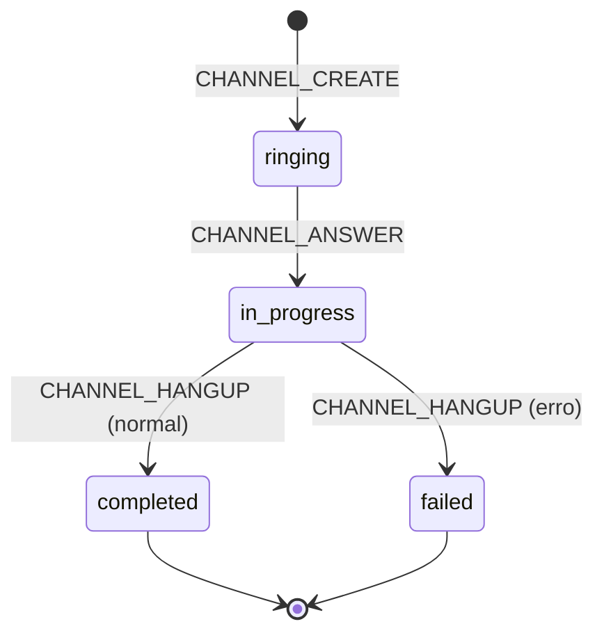

# Máquinas de Estado — zenith-voip

> Gerado pelo Detective — 2026-06-19
> Confiança: 🟢 CONFIRMADO

## Call (Chamada Telefônica)

A entidade `Call` possui um campo `status` controlado por eventos do FreeSWITCH ESL.

### Estados

```
ringing ──→ in_progress ──→ completed
                  │
                  └──→ failed
```

| Estado | Descrição |
|--------|-----------|
| `ringing` | Chamada está chamando (evento CHANNEL_CREATE) |
| `in_progress` | Chamada em andamento (evento CHANNEL_ANSWER) |
| `completed` | Chamada finalizada normalmente (evento CHANNEL_HANGUP) |
| `failed` | Chamada falhou |

### Transições

| De | Para | Gatilho | Origem |
|----|------|---------|--------|
| (qualquer) | `ringing` | CHANNEL_CREATE (ESL) | `esl_client.py:134-137` |
| `ringing` | `in_progress` | CHANNEL_ANSWER (ESL) | `esl_client.py:139-149` |
| `in_progress` | `completed` | CHANNEL_HANGUP (ESL) | `esl_client.py` (evento escutado) |
| `in_progress` | `failed` | CHANNEL_HANGUP com falha | 🟡 INFERIDO |

**Observação:** O callback de CHANNEL_HANGUP está registrado nos eventos ESL mas não há handler explícito no código. O evento é escutado mas o tratamento é implícito, indicando possível callback futuro.

### Diagrama Mermaid



## Tenant

A entidade `Tenant` possui um campo `status`.

### Estados

```
active ←──→ inactive
```

| Estado | Descrição |
|--------|-----------|
| `active` | Tenant ativo, schema e dados acessíveis |
| `inactive` | Tenant desativado (não consultado no cleanup: `WHERE status = 'active'`) |

### Transições

| De | Para | Gatilho |
|----|------|---------|
| `active` | `inactive` | Admin desativa o tenant |
| `inactive` | `active` | Admin reativa o tenant |

## Sessão WebSocket (Agent Assist)

```
disconnected → connecting → online → (connected)
                    │                    │
                    └──→ error ───→ disconnected
                             
online ──→ fallback (STT fallback ativo)
```

### Transições (via ws-client.js)

| De | Para | Gatilho |
|----|------|---------|
| desconectado | `Conectando...` | `connect()` chamado |
| `Conectando...` | 🟢 `Online` | `ws.onopen` |
| `Conectando...` | ⚠ `Erro` | `ws.onerror` |
| 🟢 `Online` | 🔴 `Desconectado` | `ws.onclose` (reconnect após 3s) |
| 🟢 `Online` | 🟢 `Deepgram/Fallback` | Mensagem `stt_status` |

## Consenso (LangGraph)

```
extractor → reviewer → decider → [approved/bypass → END]
                  ↑                    |
                  └──── rejected ──────┘ (se iteration < 3)
                       (senão → END)
```
