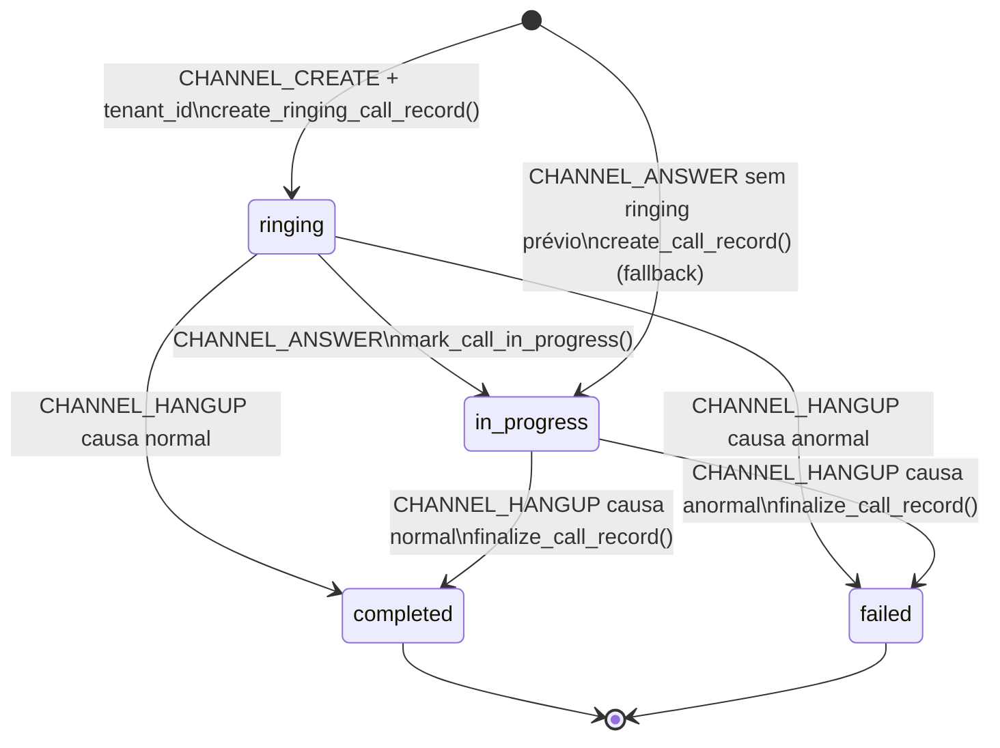
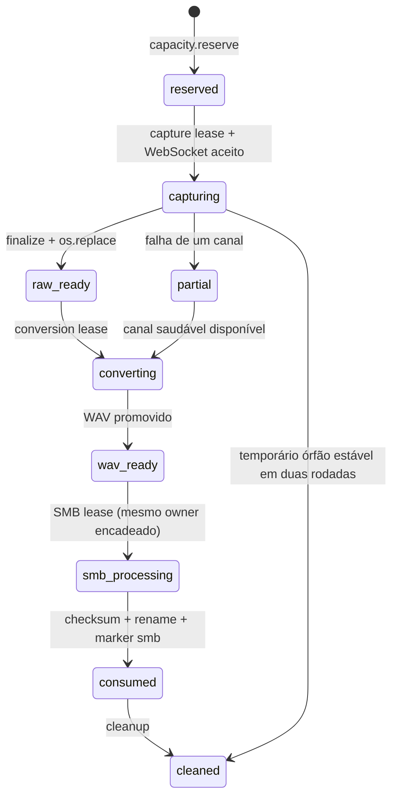
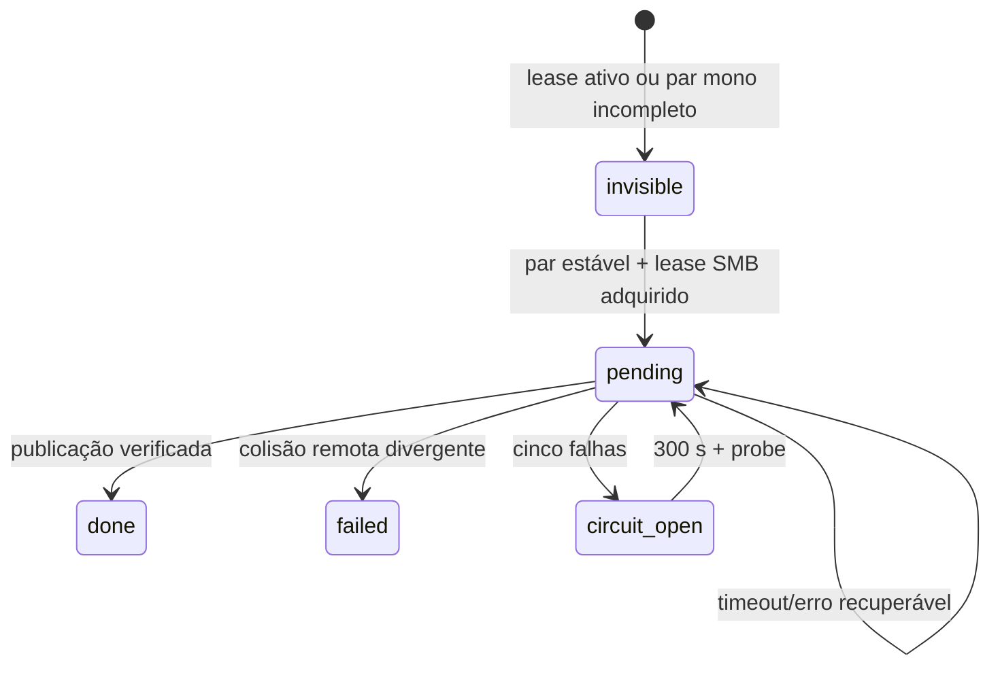

# Máquinas de Estado — zenith-voip

> Gerado pelo Detective — 2026-06-19
> **Re-extração incremental — 2026-07-27** (deltas D-01/D-05)
> Confiança: 🟢 CONFIRMADO

## Call (Chamada Telefônica)

A entidade `Call` possui um campo `status` controlado por eventos do FreeSWITCH ESL.

### Estados

```
ringing ──→ in_progress ──→ completed
   │              │
   └──→ failed ←──┘
```

| Estado | Descrição |
|--------|-----------|
| `ringing` | Estado inicial — a linha `Call` **nasce** aqui, no CHANNEL_CREATE, **somente** quando `variable_zenith_tenant_id` já vem no evento (var de canal injetada pelo diretório dinâmico, hoje só para tronco ATA). Ramal local (`local_extension`/`echo_test`) nunca seta essa var em nenhum evento do ciclo de vida — continua sem linha `ringing`, residual do GAP-RE-03 |
| `in_progress` | CHANNEL_ANSWER promove a linha `ringing` existente; se nenhuma existir (tenant não resolvido no CREATE), cria diretamente em `in_progress` — mesmo comportamento de fallback de antes da correção |
| `completed` | CHANNEL_HANGUP com `Hangup-Cause` classificada como encerramento normal (`NORMAL_CLEARING`, `NORMAL_UNSPECIFIED`) |
| `failed` | CHANNEL_HANGUP com `Hangup-Cause` fora do conjunto de encerramento normal (`NO_ANSWER`, `USER_BUSY`, `CALL_REJECTED`, `ORIGINATOR_CANCEL`, causa ausente/desconhecida, etc.) — cobre tanto chamada que nunca foi atendida (ainda `ringing`) quanto chamada que caiu no meio (`in_progress`) |

### Transições (atualizadas — fix GAP-RE-02, 2026-08-21)

| De | Para | Gatilho | Origem |
|----|------|---------|--------|
| (inexistente) | `ringing` | CHANNEL_CREATE com `tenant_id` resolvível | `esl_client.py::_handle_channel_create` → `services/calls.py::create_ringing_call_record` |
| `ringing` | `in_progress` | CHANNEL_ANSWER, linha `ringing` encontrada por `call_id` | `esl_client.py::_handle_channel_answer` → `services/calls.py::mark_call_in_progress` |
| (inexistente) | `in_progress` | CHANNEL_ANSWER **sem** linha `ringing` prévia (tenant não resolvido no CREATE) — fallback preservado | `esl_client.py::_handle_channel_answer` → `services/calls.py::create_call_record` |
| `ringing` ou `in_progress` | `completed` | CHANNEL_HANGUP, `Hangup-Cause` normal | `esl_client.py::_handle_channel_hangup` → `services/calls.py::finalize_call_record` |
| `ringing` ou `in_progress` | `failed` | CHANNEL_HANGUP, `Hangup-Cause` anormal ou ausente | `esl_client.py::_handle_channel_hangup` → `services/calls.py::finalize_call_record` |

**Mudanças em relação a 2026-07-27:**

1. `CHANNEL_CREATE` agora cria a linha `Call` em `ringing` quando `variable_zenith_tenant_id` já
   vem no evento — deixa de depender só do `CHANNEL_ANSWER` para nascer, mas só para tronco ATA
   (var injetada pelo diretório dinâmico `mod_xml_curl`). **Guardado por
   `Call-Direction == "inbound"`** — CHANNEL_CREATE dispara para as duas pernas de toda chamada
   bridgeada, e a perna B (`outbound`) nunca carrega tenant_id de verdade; sem o guard, um
   fallback teria criado uma linha `ringing` órfã por chamada bridgeada (achado e corrigido em
   2026-08-21, antes do merge, com evento real do FreeSWITCH). Um fallback via `global_getvar`
   para cobrir ramal local também foi tentado e **removido** pelo mesmo motivo: ramal local nunca
   seta `zenith_*` em nenhum evento do ciclo de vida, então a linha ficaria órfã do mesmo jeito.
2. `finalize_call_record` agora recebe `Hangup-Cause` do evento e classifica `completed` vs
   `failed` — deixa de assumir sempre `completed`.
3. `*88` (manual linkage) continua **sem** gerar linha `Call` — é sinal interno, não chamada real.
4. Uma chamada de tronco cujo `mod_xml_curl` não injete `zenith_tenant_id` continua sem linha em
   `ringing` (GAP-RE-03 permanece parcialmente aberto para esse caminho específico — ver nota
   abaixo). O fallback de var global só cobre o caminho de extensão local do dialplan.
5. `duration_seconds` continua calculado no hangup (`ended_at - started_at`); para uma chamada que
   nunca saiu de `ringing`, mede o tempo de toque, não de conversa.

### Diagrama Mermaid


```mermaid
stateDiagram-v2
    [*] --> ringing : CHANNEL_CREATE + tenant_id\ncreate_ringing_call_record()
    ringing --> in_progress : CHANNEL_ANSWER\nmark_call_in_progress()
    [*] --> in_progress : CHANNEL_ANSWER sem ringing prévio\ncreate_call_record() (fallback)
    ringing --> completed : CHANNEL_HANGUP causa normal
    ringing --> failed : CHANNEL_HANGUP causa anormal
    in_progress --> completed : CHANNEL_HANGUP causa normal\nfinalize_call_record()
    in_progress --> failed : CHANNEL_HANGUP causa anormal\nfinalize_call_record()
    completed --> [*]
    failed --> [*]
```

### Lacunas desta máquina de estados

| Lacuna | Impacto |
|---|---|
| ✅ `failed` nunca era atribuído | Fechado (2026-08-21) — classificação por `Hangup-Cause` |
| ✅ `ringing` nunca era atribuído | Fechado (2026-08-21) — CHANNEL_CREATE cria a linha quando tenant resolvível |
| 🟡 Chamada de tronco sem `tenant_id` injetado por `mod_xml_curl` não gera linha `ringing` | Residual de GAP-RE-03 — fallback de var global só cobre extensão local, não troncos ATA |

## Tenant

A entidade `Tenant` possui um campo `status`.

### Estados

```
active ←──→ inactive
```

| Estado | Descrição |
|--------|-----------|
| `active` | Tenant ativo, schema e dados acessíveis |
| `inactive` | Tenant desativado (não consultado no cleanup: `WHERE status = 'active'`) |

### Transições

| De | Para | Gatilho |
|----|------|---------|
| `active` | `inactive` | Admin desativa o tenant |
| `inactive` | `active` | Admin reativa o tenant |

## Sessão WebSocket (Agent Assist)

```
disconnected → connecting → online → (connected)
                    │                    │
                    └──→ error ───→ disconnected
                             
online ──→ fallback (STT fallback ativo)
```

### Transições (via ws-client.js)

| De | Para | Gatilho |
|----|------|---------|
| desconectado | `Conectando...` | `connect()` chamado |
| `Conectando...` | 🟢 `Online` | `ws.onopen` |
| `Conectando...` | ⚠ `Erro` | `ws.onerror` |
| 🟢 `Online` | 🔴 `Desconectado` | `ws.onclose` (reconnect após 3s) |
| 🟢 `Online` | 🟢 `Deepgram/Fallback` | Mensagem `stt_status` |

## Consenso (LangGraph)

```
extractor → reviewer → decider → [approved/bypass → END]
                  ↑                    |
                  └──── rejected ──────┘ (se iteration < 3)
                       (senão → END)
```

## Re-extração incremental — 2026-08-17

### Tronco ATA — registro operacional

```mermaid
stateDiagram-v2
    [*] --> unknown : criação ou mudança de identidade
    unknown --> registered : sofia::register / reconciliação
    registered --> unregistered : unregister / expire
    unregistered --> registered : novo register
    registered --> unknown : início de reconciliação após reconnect
```

| De | Para | Gatilho | Observação |
|---|---|---|---|
| inexistente | `unknown` | criação/importação | tronco nasce desabilitado por padrão |
| qualquer | `unknown` | identidade/senha alterada ou reconciliação inicial | evita declarar registro stale como válido |
| `unknown`/`unregistered` | `registered` | evento Sofia ou linha observada no profile | atualiza `last_registered_at` |
| `registered` | `unregistered` | unregister/expire | atualiza `last_unregistered_at` |

### Gravação — lifecycle cross-stage


```mermaid
stateDiagram-v2
    [*] --> reserved : capacity.reserve
    reserved --> capturing : capture lease + WebSocket aceito
    capturing --> raw_ready : finalize + os.replace
    capturing --> partial : falha de um canal
    raw_ready --> converting : conversion lease
    partial --> converting : canal saudável disponível
    converting --> wav_ready : WAV promovido
    wav_ready --> smb_processing : SMB lease (mesmo owner encadeado)
    smb_processing --> consumed : checksum + rename + marker smb
    consumed --> cleaned : cleanup
    capturing --> cleaned : temporário órfão estável em duas rodadas
```

- Em qualquer estado ativo, lease renovado conserva a posse; owner diferente recebe
  `LeaseBusyError`. Lease expirado pode ser reclamado sob `flock`.
- Perda de lease cancela conversão/SMB e não publica artefato parcial como final.
- Cleanup nunca atravessa lease válido e apaga candidaturas antigas quando atividade reaparece.

### Transferência SMB


```mermaid
stateDiagram-v2
    [*] --> invisible : lease ativo ou par mono incompleto
    invisible --> pending : par estável + lease SMB adquirido
    pending --> done : publicação verificada
    pending --> pending : timeout/erro recuperável
    pending --> failed : colisão remota divergente
    pending --> circuit_open : cinco falhas
    circuit_open --> pending : 300 s + probe
```

`invisible` não é persistido no transfer log. `done` é idempotente por SHA-256; entradas
`done`/`failed` antigas são removidas do log após sete dias.
