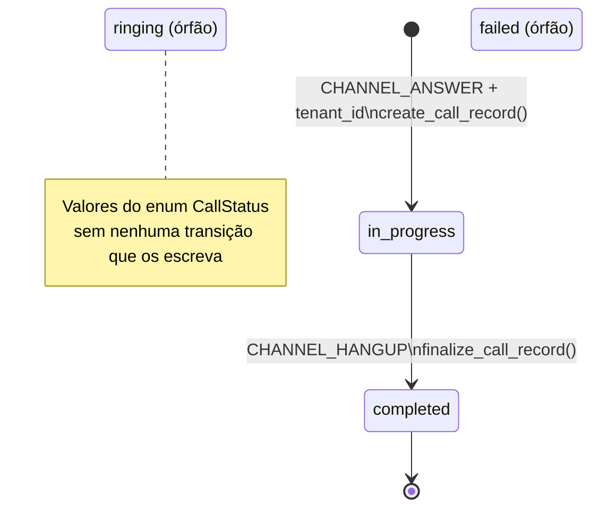

# Máquinas de Estado — zenith-voip

> Gerado pelo Detective — 2026-06-19
> **Re-extração incremental — 2026-07-27** (deltas D-01/D-05)
> Confiança: 🟢 CONFIRMADO

## Call (Chamada Telefônica)

A entidade `Call` possui um campo `status` controlado por eventos do FreeSWITCH ESL.

### Estados

```
in_progress ──→ completed
      │
      └──→ failed
```

| Estado | Descrição |
|--------|-----------|
| `ringing` | Valor do enum, **nunca atribuído em código** 🔴 |
| `in_progress` | Estado inicial real — a linha `Call` **nasce** aqui, no CHANNEL_ANSWER |
| `completed` | Chamada finalizada (CHANNEL_HANGUP com registro prévio) |
| `failed` | Valor do enum, **nunca atribuído em código** 🔴 |

### Transições (atualizadas)

| De | Para | Gatilho | Origem |
|----|------|---------|--------|
| (inexistente) | `in_progress` | CHANNEL_ANSWER **com `tenant_id` populado** | `esl_client.py:219-223` → `services/calls.py:11-21` |
| `in_progress` | `completed` | CHANNEL_HANGUP com `Call` encontrada por `call_id` | `esl_client.py:240-250` → `services/calls.py:24-38` |
| — | `ringing` | ❌ nenhuma transição escreve este estado | — |
| — | `failed` | ❌ nenhuma transição escreve este estado | — |

**Mudanças em relação a 2026-06-19:**

1. O handler `_handle_channel_hangup` **agora existe de fato** — a observação anterior
   ("evento escutado mas tratamento implícito") não vale mais.
2. `CHANNEL_CREATE` **não cria nem altera** a linha `Call`. Ele só detecta `*88` para manual
   linkage. Logo, `ringing` é um estado do enum que nenhum caminho de código atribui.
3. A criação depende de `tenant_id` vir populado no evento. Sem ele, **a chamada acontece e
   nenhum registro existe** — não há estado de erro, há ausência de linha.
4. `duration_seconds` é calculado no hangup (`ended_at - started_at`), não medido durante.
5. Um `CHANNEL_HANGUP` sem `Call` correspondente retorna em silêncio.

### Diagrama Mermaid


```mermaid
stateDiagram-v2
    [*] --> in_progress : CHANNEL_ANSWER + tenant_id\ncreate_call_record()
    in_progress --> completed : CHANNEL_HANGUP\nfinalize_call_record()
    completed --> [*]

    state "ringing (órfão)" as ringing
    state "failed (órfão)" as failed
    note right of ringing
      Valores do enum CallStatus
      sem nenhuma transição que os escreva
    end note
```

### Lacunas desta máquina de estados

| Lacuna | Impacto |
|---|---|
| 🔴 `failed` nunca é atribuído | Chamada que cai por erro fica eternamente `in_progress` no banco |
| 🔴 `ringing` nunca é atribuído | Não há registro do intervalo entre criação do canal e atendimento |
| 🔴 Chamada sem `tenant_id` não gera linha alguma | Perda silenciosa: não há como distinguir "não houve chamada" de "houve chamada não registrada" |

## Tenant

A entidade `Tenant` possui um campo `status`.

### Estados

```
active ←──→ inactive
```

| Estado | Descrição |
|--------|-----------|
| `active` | Tenant ativo, schema e dados acessíveis |
| `inactive` | Tenant desativado (não consultado no cleanup: `WHERE status = 'active'`) |

### Transições

| De | Para | Gatilho |
|----|------|---------|
| `active` | `inactive` | Admin desativa o tenant |
| `inactive` | `active` | Admin reativa o tenant |

## Sessão WebSocket (Agent Assist)

```
disconnected → connecting → online → (connected)
                    │                    │
                    └──→ error ───→ disconnected
                             
online ──→ fallback (STT fallback ativo)
```

### Transições (via ws-client.js)

| De | Para | Gatilho |
|----|------|---------|
| desconectado | `Conectando...` | `connect()` chamado |
| `Conectando...` | 🟢 `Online` | `ws.onopen` |
| `Conectando...` | ⚠ `Erro` | `ws.onerror` |
| 🟢 `Online` | 🔴 `Desconectado` | `ws.onclose` (reconnect após 3s) |
| 🟢 `Online` | 🟢 `Deepgram/Fallback` | Mensagem `stt_status` |

## Consenso (LangGraph)

```
extractor → reviewer → decider → [approved/bypass → END]
                  ↑                    |
                  └──── rejected ──────┘ (se iteration < 3)
                       (senão → END)
```
