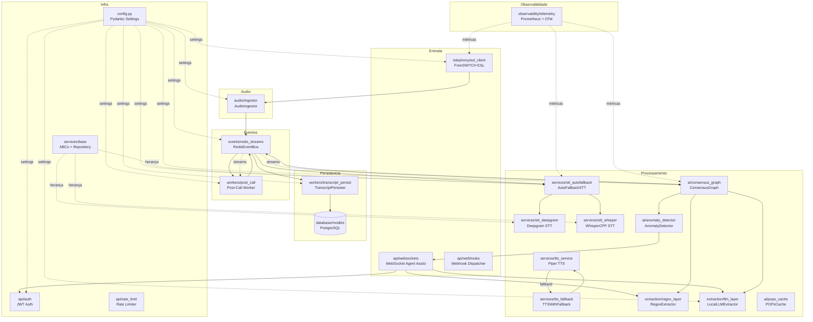

# Zenith AI Audio Hub — Guia da Arquitetura

## Filosofia do Projeto

Sistema de voz-assistência em tempo real com foco em resiliência, troca
transparente de providers, e observabilidade nativa.

---

## 1. Organização por Domínio

```
src/
├── config.py          # Config centralizada (Pydantic)
├── main.py            # Entrypoint FastAPI (lifespan, health, ready)
├── ai/                # Inteligência: anomalias, grafo de consenso, cache
├── api/               # HTTP: auth, rate-limit, webhooks, websockets
├── audio/             # Ingestão de fluxo de áudio
├── database/          # ORM, engine, modelos SQLAlchemy
├── events/            # Barramento Redis Streams
├── extraction/        # Extração de entidades (regex + LLM)
├── observability/     # Métricas Prometheus + OpenTelemetry
├── services/          # Estratégias de negócio (STT, TTS, fallback)
├── telephony/         # Integração FreeSWITCH ESL
└── workers/           # Background jobs (ARQ)
```

Cada pasta agrupa arquivos por **responsabilidade de negócio** — não por tipo
técnico. Não há pastas `models/`, `controllers/`, `utils/`. Isso faz o sistema
escalar em organização: você sabe exatamente onde mora cada funcionalidade.

---

## 2. Config com Pydantic (nunca `os.environ` direto)

```python
# src/config.py
class Settings(BaseSettings):
    DATABASE_URL: str = "postgresql+asyncpg://..."
    REDIS_URL: str = "redis://redis:6379/0"
    model_config = {"env_file": ".env"}

settings = Settings()  # singleton
```

- **Tipagem forte** com validação automática
- **Singleton** em nível de módulo — importa-se `from src.config import settings`
- Nenhum arquivo lê `os.getenv()`; tudo passa pelo `Settings`
- `.env` como única fonte de verdade

---

## 3. Strategy Pattern para Serviços

```python
class STTStrategy(ABC):
    @abstractmethod
    async def transcribe(self, audio_chunk, **kwargs): ...

class DeepgramSTT(STTStrategy): ...
class WhisperCppSTT(STTStrategy): ...

class AutoFallbackSTT(STTStrategy):  # Composite
    async def transcribe(self, audio_chunk, **kwargs):
        try:
            return await self.primary.transcribe(audio_chunk, timeout=0.5)
        except:
            return await self.fallback.transcribe(audio_chunk)
```

Classes abstratas (`ABC`) permitem trocar providers sem modificar consumidores.
`AutoFallbackSTT` é um **Decorator/Composite** que adiciona resiliência:

1. Tenta Deepgram (primário) com timeout de 500ms
2. Se falha ou confidence < 0.3, cai para Whisper (local)
3. Retorna flag `fallback_activated: true`

---

## 4. Singleton por Módulo

```python
# events/redis_streams.py
event_bus = RedisEventBus()

# telephony/esl_client.py
esl_client = ESLClient()
```

Quase todo módulo exporta **uma instância pronta para uso**. Funciona bem para
sistemas single-process sem container DI.

---

## 5. Async do Começo ao Fim

- FastAPI `async` endpoints
- SQLAlchemy `create_async_engine` + `AsyncSession`
- Redis `async` com `XADD` / `XREADGROUP`
- Websockets com `async/await`
- Workers ARQ (asyncio nativo)

Exceção: `WhisperCppSTT` executa `subprocess.run` (bloqueante) deliberadamente,
pois é processo externo.

---

## 6. Barramento de Eventos (Redis Streams)

```python
# publish
await event_bus.publish("call:events", {"type": "audio_chunk"})

# consume
async for msg_id, data in event_bus.consume("call:events", "zenith-workers"):
    ...
    await event_bus.ack("call:events", "zenith-workers", msg_id)
```

Usa **consumer group** (não pub/sub simples) para processamento garantido:
mensagens não se perdem se o worker cair.

---

## 7. Repository Genérico com TypeVar

```python
ModelType = TypeVar("ModelType", bound=Base)

class Repository(Generic[ModelType]):
    async def create(self, model: ModelType) -> ModelType: ...
    async def get(self, id: UUID) -> ModelType | None: ...
    async def find_by(self, **kwargs) -> list[ModelType]: ...
```

CRUD genérico reutilizável para qualquer modelo SQLAlchemy. Evita repetir
query boilerplate.

---

## 8. Namespace Packages Implícitos (sem `__init__.py`)

Python 3.3+ permite pacotes sem `__init__.py` (PEP 420). O projeto adota isso:
menos boilerplate, pastas são apenas diretórios de organização.

---

## 9. Rate Limit (sliding window em memória)

```python
@app.middleware("http")
async def rate_limit_middleware(request, call_next):
    ip = request.client.host
    window = [t for t in store[ip] if now - t < 60]
    if len(window) >= 100:
        return JSONResponse(status_code=429)
    store[ip].append(now)
    return await call_next(request)
```

Simples, sem Redis. Bom para MVP — troca-se para Redis-backed quando escalar.

---

## 10. Observabilidade Embutida

```python
stt_latency = Histogram("stt_latency_ms", "...", labelnames=["provider"])
```

Prometheus + OpenTelemetry configurados em módulo dedicado (`observability/`).

---

## Fluxograma de Relacionamento entre Módulos



### Legenda

| Símbolo | Significado |
|---------|-------------|
| `-->`   | Fluxo de dados / chamada direta |
| `-.->`  | Configuração / observabilidade |
| `# Postgres` | Banco de dados |

### Fluxo Principal de uma Chamada

```
FreeSWITCH ESL → AudioIngestor → Redis Streams
                                      ↓
                              AutoFallbackSTT
                              ├── Deepgram (primário)
                              └── Whisper (fallback)
                                      ↓
                              ConsensusGraph
                              ├── RegexExtractor
                              ├── LocalLLMExtractor
                              └── AnomalyDetector → WebSocket (alerta)
                                      ↓
                              TranscriptPersister → PostgreSQL
                              Post-Call Worker → Redis Streams
```

---

## Resumo das Práticas

| Prática | Por que usar |
|---------|--------------|
| Organização por domínio | Escala melhor que MVC |
| Pydantic Settings | Tipagem + validação + `.env` |
| Strategy Pattern | Troca provider sem efeito colateral |
| Singleton por módulo | Simples, sem container DI |
| Async nativo | Performance I/O-bound |
| Event bus (Redis Streams) | Desacopla módulos |
| Repository genérico | Evita repetição de CRUD |
| Namespace packages | Menos boilerplate |
| Observabilidade nativa | Debug em produção |
| Fallback em cascata | Resiliência sem downtime |
